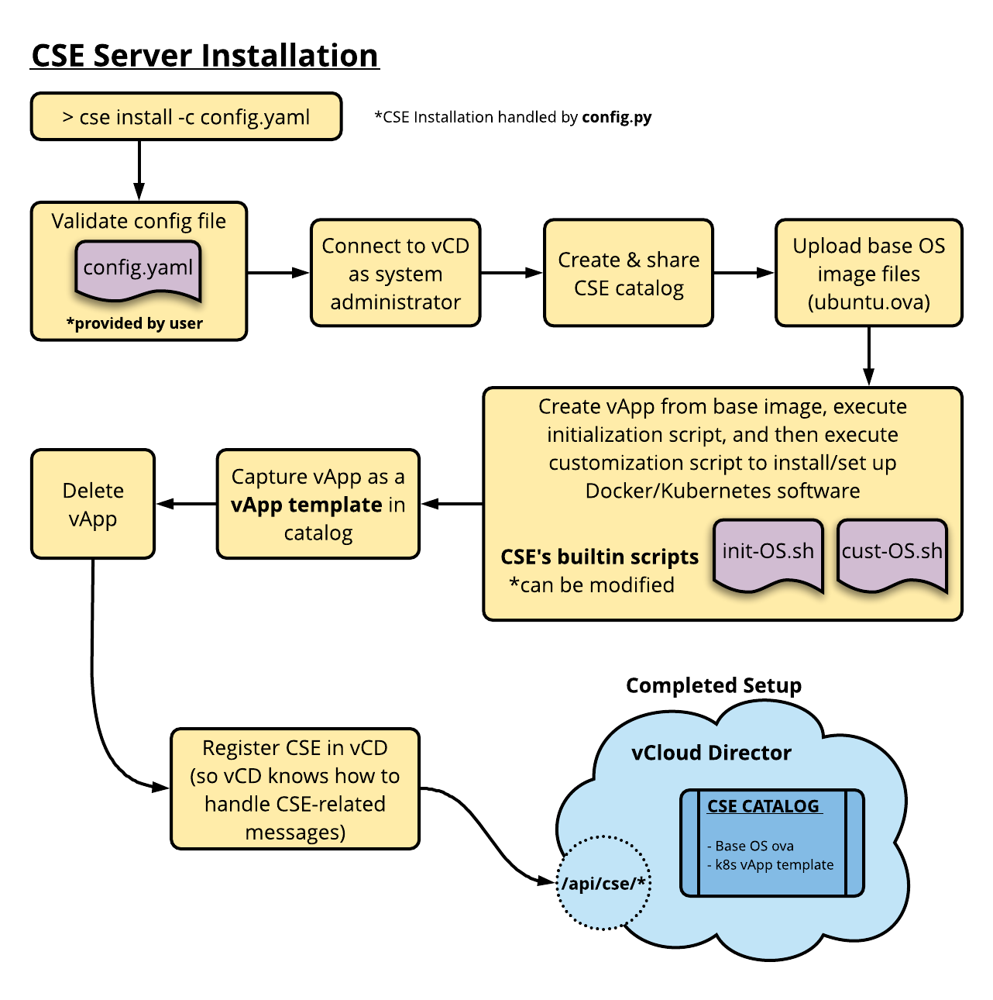

# CSE Server Management

<a name="overview"></a>
## Overview

This page contains procedures to install and manage Container Service
Extension on vCloud Director.  Users who perform these procedures
are cloud administrators with sysadmin access and a solid understanding
of vCD management.

Information on the page falls into three main areas.

1. System prerequisites and background relevant to managing CSE server.
2. Step-by-step server installation.
3. Operational procedures and hints.

Procedures on this page make regular use of vcd-cli commands to
perform admistrative operations.  Please refer to the [vcd-cli
documentation](https://vmware.github.io/vcd-cli/) if necessary to get familiar with command line
operations against vCD.

<a name="compatibility"></a>
## CSE Server Versions

CSE servers run the Python container-service-extension (CSE) package
and its dependencies.  The following table shows compatibility
between CSE and vCD versions.  For new installations we recommend
using the highest available CSE version.

| CSE version | vCD version         |
|-------------|---------------------|
| 1.1.x       | 8.20, 9.0, 9.1      |
| 1.2.x       | 9.0, 9.1, 9.5       |

---

<a name="prerequisites"></a>
## vCD Prerequisites

There are several important requirements that must be fulfilled to install
CSE successfully on vCD.

* Provide an org.
* Provide a VDC within the org that has an external org network in which vApps may be instantiated and sufficient storage to create vApps and publish them as templates. The external network connection is required to enable template VMs to download packages during configuration.
* Provide a user in the org with privileges necessary to perform operations like configuring AMQP, creating public catalog entries, and managing vApps.  
* A good network connection from the host running installation to vCD as well as the Internet.  This avoids intermittent failures in OVA upload/download operations.

You can use existing resources from your vCD installation or create
new ones. The following sub-sections illustrate how to set up a
suitable org + VDC + user from scratch.

### Create an Org

Use the UI or vcd-cli to create an org for CSE use.
```
vcd org create --enabled cse_org_1 'Org for CSE work'
```

### Create a VDC with Attached Network

Next create a VDC that has an org VDC network that can route network traffic
from VMs to the Internet. Here are sample vcd-cli commands.
```
# Switch to org and create VDC under it.
vcd org use cse_org_1
vcd vdc create cse_vdc_1 --provider-vdc=vc1-TestbedCluster-21:14:12 \
  --allocation-model=AllocationVApp \
  --storage-profile='*' \
  --description='CSE work'
# Switch to the new VDC and add an outbound network. The 'Corporate'
# network must already exist as an external network. Create this in the
# UI.
vcd vdc use cse_vdc_1
vcd network direct create Outside \
  --description='Internet facing network' \
  --parent='Corporate' \
  --shared
```

### Create a CSE User

You can use a vCD admin account for CSE but it is better to create
a service account that minimizes required privileges.  This reduces the
chances of an attacker gaining full access to the system.

The simplest way to set privileges is first to create a role with
necessary rights and then assign it to the CSE user.  The following
vcd-cli commands show how to create the role.  Note that required
rights may change in a future CSE release, so check back here when
upgrading.

**NOTE:** The privilege set does not appear to be correct at this time.
We recommend using a vCD admin account for the time being.  See [Issue 139](https://github.com/vmware/container-service-extension/issues/139).

```
# Create a role.
vcd role create --org System CSE 'CSE Administrator'
# Add required rights to role.
vcd role add-right --org System CSE \
  "Catalog: CLSP Publish Subscribe" \
  "Catalog: Create / Delete a Catalog" \
  "Catalog: Edit Properties" \
  "Catalog: Import Media from vSphere" \
  "Catalog: Publish" \
  "Catalog: Sharing" \
  "Catalog: View ACL" \
  "Catalog: View Private and Shared Catalogs" \
  "Catalog: View Published Catalogs" \
  "Cell Configuration: View" \
  "Disk: Change Owner" \
  "Disk: Create" \
  "Disk: Delete" \
  "Disk: Edit Properties" \
  "Disk: View Properties" \
  "General: Administrator View" \
  "General: View Error Details" \
  "Host: View" \
  "Organization Network: Open in vSphere" \
  "Organization Network: View" \
  "Organization vDC Network: View Properties" \
  "Organization vDC Resource Pool: Open in vSphere" \
  "Organization vDC Resource Pool: View" \
  "Organization vDC Storage Policy: Open in vSphere" \
  "Organization vDC: Extended View" \
  "Organization vDC: View" \
  "Organization vDC: View ACL" \
  "Organization: View" \
  "System Operations: Execute System Operations" \
  "Task: Resume, Abort, or Fail" \
  "Task: Update" \
  "VAPP_VM_METADATA_TO_VCENTER" \
  "VDC Template: Instantiate" \
  "VDC Template: View" \
  "vApp Template / Media: Copy" \
  "vApp Template / Media: Create / Upload" \
  "vApp Template / Media: Edit" \
  "vApp Template / Media: View" \
  "vApp Template: Checkout" \
  "vApp Template: Download" \
  "vApp Template: Import" \
  "vApp Template: Open in vSphere" \
  "vApp: Allow All Extra Config" \
  "vApp: Allow Ethernet Coalescing Extra Config" \
  "vApp: Allow Latency Extra Config" \
  "vApp: Allow Matching Extra Config" \
  "vApp: Allow NUMA Node Affinity Extra Config" \
  "vApp: Change Owner" \
  "vApp: Copy" \
  "vApp: Create / Reconfigure" \
  "vApp: Delete" \
  "vApp: Download" \
  "vApp: Edit Properties" \
  "vApp: Edit VM CPU" \
  "vApp: Edit VM CPU and Memory reservation settings in all VDC types" \
  "vApp: Edit VM Hard Disk" \
  "vApp: Edit VM Memory" \
  "vApp: Edit VM Network" \
  "vApp: Edit VM Properties" \
  "vApp: Enter/Exit Maintenance Mode" \
  "vApp: Import Options" \
  "vApp: Manage VM Password Settings" \
  "vApp: Open in vSphere" \
  "vApp: Power Operations" \
  "vApp: Shadow VM View" \
  "vApp: Sharing" \
  "vApp: Snapshot Operations" \
  "vApp: Upload" \
  "vApp: Use Console" \
  "vApp: VM Boot Options" \
  "vApp: VM Check Compliance" \
  "vApp: VM Migrate, Force Undeploy, Relocate, Consolidate" \
  "vApp: View ACL" \
  "vApp: View VM metrics" \
  "vCenter: Open in vSphere" \
  "vCenter: Refresh" \
  "vCenter: View"
```

You can now create a CSE admin user with the CSE role as follows

```
vcd user create --enabled cse_admin 't0pS3cret!' CSE
```

<a name="configfile"></a>
## Server Config File
The CSE server is controlled by a yaml configuration file that must
be filled out prior to installation.  You can generate a skeleton
file as follows.

```sh
cse sample > config.yaml
```

Edit this file to add values from your vCloud Director installation. The
following example shows a file with sample values filled out.

```
# Sample CSE configuration file.
amqp:
  exchange: cse-exchange
  host: bos1-vcd-sp-static-202-42.eng.vmware.com
  password: amqp_password
  port: 5672
  prefix: cse-prefix-vcd
  routing_key: cse-routing-key
  ssl: false
  ssl_accept_all: false
  username: amqp_user
  vhost: /

vcd:
  api_version: '31.0'
  host: 10.150.201.243
  log: true
  password: vc_admin_password
  port: 443
  username: administrator
  verify: false

vcs:
- name: vcenter1
  password: vc_admin_password
  username: administrator@vsphere.local
  verify: false

service:
  listeners: 5

broker:
  catalog: cse-cat # public shared catalog within org where the template will be published
  cse_msg_dir: /tmp/cse # not used
  default_template: ubuntu-16.04 # name of the default template to use if none is specified
  ip_allocation_mode: pool # dhcp or pool
  network: Outside # org network within @vdc that will be used during the install process to build the template
                          # Should have outbound access to the public internet
                          # CSE appliance doesn't need to be connected to this network
  org: cse_org_1 # vCD org that contains the shared catalog where the master templates will be stored
  storage_profile: '*' # name of the storage profile to use when creating the temporary vApp used to build the template
  templates:
  - admin_password: guest_os_admin_password
    catalog_item: ubuntu-16.04-server-cloudimg-amd64-k8s
    # Clean marked false to work around https://github.com/vmware/container-service-extension/issues/170
    cleanup: false
    cpu: 2
    description: 'Ubuntu 16.04

      Docker 18.03.0~ce

      Kubernetes 1.10.1

      weave 2.3.0'
    mem: 2048
    name: ubuntu-16.04
    sha256_ova: 3c1bec8e2770af5b9b0462e20b7b24633666feedff43c099a6fb1330fcc869a9
    source_ova: https://cloud-images.ubuntu.com/releases/xenial/release-20180418/ubuntu-16.04-server-cloudimg-amd64.ova
    source_ova_name: ubuntu-16.04-server-cloudimg-amd64.ova
    temp_vapp: ubuntu1604-temp
  - admin_password: guest_os_admin_password
    catalog_item: photon-custom-hw11-2.0-304b817-k8s
    cleanup: true
    cpu: 2
    description: 'PhotonOS v2

      Docker 17.06.0-4

      Kubernetes 1.9.1

      weave 2.3.0'
    mem: 2048
    name: photon-v2
    sha256_ova: cb51e4b6d899c3588f961e73282709a0d054bb421787e140a1d80c24d4fd89e1
    source_ova: http://dl.bintray.com/vmware/photon/2.0/GA/ova/photon-custom-hw11-2.0-304b817.ova
    source_ova_name: photon-custom-hw11-2.0-304b817.ova
    temp_vapp: photon2-temp
  type: default
  vdc: cse_vdc_1 # VDC within @org that will be used during the install process to build the template
```

The config file has 5 sections: `amqp`, `vcd`, `vcs`, `service`,
and `broker`.  The following sub-sections explain the principle
configuration properties for each section as well as how they are
used.

### `amqp` Section

During CSE Server installation, CSE will set up AMQP to ensure
communication between vCD and the running CSE server.  The `amqp`
section controls the AMQP communication parameters. The following
properties will need to be set for all deployments.

| Property          | Value |
|:------------------|:------------------------------------------------------------------------------------------------|
| host            | IP or hostname of the vCloud Director AMQP server (may be different from the vCD cell hosts) |
| username        | Username of the vCD service account with minimum roles and rights |
| password        | Password of the vCD service account |

Other properties may be left as is or edited to match site conventions.

For more information on AMQP settings, see the [vCD API documention on AMQP](https://code.vmware.com/apis/442/vcloud#/doc/doc/types/AmqpSettingsType.html).

### `vcs` Section
Properties in this section supply credentials necessary for the following operations:
- Guest Operation Program Execution
- Guest Operation Modifications
- Guest Operation Queries

Each `vc` under the `vcs` section has the following properties:

| Property          | Value                                                                                           |
|:------------------|:------------------------------------------------------------------------------------------------|
| name            | Name of the vCenter registered in vCD                                                                           |
| username        | Username of the vCenter service account with minimum of guest-operation privileges             |
| password        | Password of the vCenter service account                                                        |

### `service` Section

The service section specifies the number of threads to run in the CSE
server process.

### `broker` Section

The `broker` section contains properties to define resources used by
the CSE server including org and VDC as well as template definitions.
The following table summariize key parameters.

| Property           | Value                                                                                                                                                                                                                |
|:--------------------|:----------------------------------------------------------------------------------------------------------------------------------------------------------------------------------------------------------------------|
| catalog            | Publicly shared catalog within `org` where VM templates will be published |
| cse_msg_dir        | Reserved for future use |
| cleanup            | Set to false to keep VMs used for templates from being cleaned up (helpful for debugging as well as workaround for [Issue #170](https://github.com/vmware/container-service-extension/issues/170)) |
| default_template   | Name of the default template to use if none is specified |
| network            | Org Network within `vdc` that will be used during the install process to build the template. It should have outbound access to the public Internet. The `CSE` appliance doesn't need to be connected to this network |
| ip_allocation_mode | IP allocation mode to be used during the install process to build the template. Possible values are `dhcp` or `pool`. During creation of clusters for tenants, `pool` IP allocation mode is always used              |
| org                | vCD organization that contains the shared catalog where the master templates will be stored |
| storage_profile    | Name of the storage profile to use when creating the temporary vApp used to build the template |
| templates          | A list of templates available for clusters |
| type               | Broker type, set to `default` |
| vdc                | Virtual datacenter within `org` that will be used during the install process to build the template |

Each `template` in the `templates` property has the following properties:

| Property          | Value                                                                                                                                                                                                             |
|:------------------|:------------------------------------------------------------------------------------------------------------------------------------------------------------------------------------------------------------------|
| name            | Unique name of the template |
| source_ova      | URL of the source OVA to download |
| sha256_ova      | sha256 of the source OVA |
| source_ova_name | Name of the source OVA in the catalog |
| catalog_item    | Name of the template in the catalog |
| description     | Information about the template |
| temp_vapp       | Name of the temporary vApp used to build the template. Once the template is created, this vApp can be deleted. It will be deleted by default during the installation based on the value of the `cleanup` property |
| cleanup         | If `True`, `temp_vapp` will be deleted by the install process after the master template is created |
| admin_password  | `root` password for the template and instantiated VMs. This password should not be shared with tenants |
| cpu             | Number of virtual CPUs to be allocated for each VM |
| mem             | Memory in MB to be allocated for each VM |

---

<a name="vmtemplates"></a>
## VM Templates
`CSE` supports multiple VM templates to create Kubernetes clusters
from. Templates may vary in guest OS or software versions, and must
have a unique name. One template must be defined as the default
template, and tenants have the option to specify the template to
use during cluster/node creation.

### Source .ova Files for VM Templates

The following table shows URLs for OVA files used as VM templates.

| OS                   | OVA Name                               | URL                                                                                                       | SHA256                                                           |
|----------------------|----------------------------------------|-----------------------------------------------------------------------------------------------------------|------------------------------------------------------------------|
| Photon OS 1.0, Rev 2 | photon-custom-hw11-1.0-62c543d.ova     | `https://bintray.com/vmware/photon/download_file?file_path=photon-custom-hw11-1.0-62c543d.ova`            | 6d6024c5531f5554bb0d2f51f3005078ce6d4ee63c142f2453a416824c5344ca |
| Photon OS 2.0 GA     | photon-custom-hw11-2.0-304b817.ova     | `http://dl.bintray.com/vmware/photon/2.0/GA/ova/photon-custom-hw11-2.0-304b817.ova`                       | cb51e4b6d899c3588f961e73282709a0d054bb421787e140a1d80c24d4fd89e1 |
| Ubuntu 16.04.4 LTS   | ubuntu-16.04-server-cloudimg-amd64.ova | `https://cloud-images.ubuntu.com/releases/xenial/release-20180418/ubuntu-16.04-server-cloudimg-amd64.ova` | 3c1bec8e2770af5b9b0462e20b7b24633666feedff43c099a6fb1330fcc869a9 |

### Updating VM Templates

Templates may be updated from time to time to upgrade software or
make configuration changes.  When this occurs, CSE Server should
be gracefully stopped before making VM template changes to avoid errors
that can occur when using `vcd cse cluster create ...` or `vcd cse
node create ...`

In general, updating a template doesn't have any effect on existing
Kubernetes master and worker nodes. CSE and template compatibility
can be found in release notes.

Templates can also be generated on a vCD instance that CSE Server
is not registered to. Templates can be generated in multiple vCD
instances in parallel.

To update a template rerun the `cse install` command as follows:
```sh
cse install -c config.yaml --template photon-v2 --update --amqp skip --ext skip
```

Updating a template increases `versionNumber` of the corresponding
catalog item by 1.  You can look at the version number(s) using a
vcd-cli command like the following:

```sh
vcd catalog info cse photon-custom-hw11-2.0-304b817-k8s
```
---

<a name="serversetup"></a>
## Server Setup

### Installing CSE Server

`CSE` Server should be installed by the vCloud Director System/Cloud
Administrator on a new VM or one of the existing servers that are
part of vCD. This CSE VM is the **CSE appliance**.

The CSE appliance requires network access to the vCD cell, vCenter(s),
and AMQP server. It does not require access to the network(s) where
the Kubernetes templates will be created (`network` and `temp_vapp`
config file properties) or the tenant network(s) where the clusters
will be created.

You should install the CSE software on the CSE appliance as described
in [Software Installation](/INSTALLATION.html).  Once this is done
you can invoke server setup using the `cse install` command.  The
example below shows a typical command.

```
cse install -c config.yaml --ssh-key=$HOME/.ssh/id_rsa.pub \
 --ext config --amqp config
```

The following diagram illustrates installation steps visually.




The `cse install` command supports the following options:

| Option       | Short | Argument(s)              | Description                                                                                                                                                | Default Value                                 |
|:--------------|:-------|:--------------------------|:------------------------------------------------------------------------------------------------------------------------------------------------------------|:-----------------------------------------------|
| \--config     | -c    | path/to/config.yaml      | Config file to use                                                                                                                                         | config.yaml                                   |
| \--template   | -t    | template-name            | Install the specified template                                                                                                                             | '*' (installs all templates specified in config file) |
| \--update     | -u    | n/a                      | Recreate templates during installation                                                                                                                     | False                                         |
| \--no-capture | -n    | n/a                      | Don't capture the temporary vApp as a template   (Leaves it standing for debugging purposes)                                                               | False                                         |
| \--ssh-key    | -k    | path/to/ssh-key.pub      | ssh-key file to use for vm access   (root password ssh access is disabled for security reasons)                                                            | None                                          |
| \--ext        | -e    | prompt OR skip OR config | **prompt**: ask before registering CSE<br>**skip**: do not register CSE<br>**config**: register CSE without asking for confirmation                        | prompt                                        |

To monitor the vApp customization process, you can ssh into the temporary vApp. In the temporary vApp, the output of the customization script is captured in `/tmp/FILENAME.out` as well as `/tmp/FILENAME.err`:
```sh
# print out file contents as it's being written to
tail -f /tmp/FILENAME.out
tail -f /tmp/FILENAME.err
```

The temporary vApp guest OS does not allow root ssh access via password for security reasons (use `--ssh-key` option to provide a public key).

To inspect the temporary vApp after customization, use the `--no-capture` option (also requires the `--ssh-key` option):
```sh
cse install -c config.yaml --no-capture --ssh-key ~/.ssh/id_rsa.pub
```

### Validate CSE Installation
You can validate that CSE is installed correctly using `cse check`.  Use
this command to check the configuration at any time.

```sh
cse check --config config.yaml --check-install
```
The `cse check` command supports the following options:

| Option          | Short | Argument(s)         | Description                                                           | Default                                                 |
|-----------------|-------|---------------------|-----------------------------------------------------------------------|---------------------------------------------------------|
| --config        | -c    | path/to/config.yaml | Config file to use                                                    | config.yaml                                             |
| --check-install | -i    | n/a                 | Check CSE installation on vCD                                         | False                                                   |
| --template      | -t    | template-name       | If `--check-install` is set, check that the specified template exists | '*' (checks for all templates specified in config file) |

Validate that CSE has been registered in vCD
Using `vcd-cli`, check that the extension has been registered in vCD:

```sh
# login as system administrator
vcd login vcd.serviceprovider.com System administrator --password passw0rd -w -i

# list extensions
vcd system extension list

# get details of CSE extension
vcd system extension info cse
```

### Setting the API Extension Timeout

The API extension timeout is the number of seconds that vCD waits for
a response from the CSE server extension.  The default value is 10 seconds,
which may be too short for some environments.  To alter the time follow
the steps shown below.

Configure the API extension timeout (seconds) on the vCloud
Director cell:
```sh
cd /opt/vmware/vcloud-director/bin
./cell-management-tool manage-config -n extensibility.timeout -l
./cell-management-tool manage-config -n extensibility.timeout -v 20
```

### Manual CSE API Registration

If you need to re-register the CSE API extension for any reason, use the
command shown below.  You may need to delete the extension first for
this command to work.
```sh
vcd system extension create cse cse cse vcdext '/api/cse, /api/cse/.*, /api/cse/.*/.*'
```
---
<a name="serveroperation"></a>
## Server Operation
The CSE Server uses threads to process requests. The number of AMQP
listener threads can be configured in the config file using the `listeners`
property in the `service` section.  The default value is 5.

### Running CSE Server Manually
To start the manually run the command shown below.
```sh
# Run server in foreground.
cse run --config config.yaml

# Run server in background
nohup cse run --config config.yaml > nohup.out 2>&1 &
```
Server output log can be found in `cse.log`

### Running CSE Server as a Service

A sample `systemd` unit is provided by CSE. Here are instructions for
installaion.

1. Copy file `cse.service` from CSE installation location and move it to
`/etc/systemd/system/cse.service`.  

2. Copy `cse.sh` to /home/vmware.

Once installed you can start the CSE service daemon using `systemctl
start cse`. To enable, disable, and stop the CSE service, use CSE
client.

```sh
# hook CSE unit into relevant places to automatically do things
# depending on what's specified in the unit file
$ vcd cse system enable

# start CSE service now
$ systemctl start cse

# stop processing new requests, and finish processing existing requests
# disables CSE service
$ vcd cse system disable
property    value
----------  -------
message     Updated

# wait until all active threads have finished, then exits CSE service
$ vcd cse system stop -y
property    value
----------  ---------------------------------------------------------------------
message     CSE graceful shutdown started. CSE will finish processing 4 requests.

$ vcd cse system info
property              value
--------------------  ------------------------------------------------------
all_threads           8
config_file           /Users/pgomez/vmware/cse/testbed-202-34.yaml
consumer_threads      5
description           Container Service Extension for VMware vCloud Director
product               CSE
python                3.6.4
requests_in_progress  4
status                Shutting down
version               1.2.0
```

If the CSE Server is disabled, users will get the following message
when executing any CSE command:

```bash
$ vcd cse cluster list
Usage: vcd cse cluster list [OPTIONS]

Error: CSE service is disabled. Contact the System Administrator.
```

To keep the service running after logout on Photon OS, check
`/etc/systemd/logind.conf` and set `KillUserProcesses` to `no`

```
[Login]
KillUserProcesses=no
```

### Monitoring CSE

vCD System Administrators can monitor CSE service status via CSE client:

```sh
$ vcd cse system info
property              value
--------------------  ------------------------------------------------------
all_threads           10
config_file           /opt/vmware/cse/testbed-202-34.yaml
consumer_threads      6
description           Container Service Extension for VMware vCloud Director
product               CSE
python                3.6.4
requests_in_progress  3
status                Running
version               1.2.0
```

System administrators can list all the clusters running in vCD with
a search command using cluster vApp metadata:

```bash
vcd search adminvapp -f 'metadata:cse.cluster.id!=STRING:'
```
---

<a name="serverupgrade"></a>
## Server Upgrade and Removal
When upgrading CSE versions, re-register the extension:
```sh
# remove previous registration of CSE
vcd system extension delete cse

# run cse installation again
cse install --config config.yaml
```

### Upgrading CSE Server Software

1. Gracefully stop CSE Server.
2. Reinstall `container-service-extension` from PyPI:
```bash
pip3 install --user --upgrade container-service-extension
```
3. Check the release notes at the end of this document for version compatibility.
4. Review the configuration file for any new options introduced or deprecated in the new version.
5. If the previously generated templates are no longer supported by the new version, delete the templates and re-generate new ones.
6. If running CSE as a service, start the new version of the service with `systemctl start cse`.

### Uninstalling CSE Server

1. Gracefully stop CSE Server
2. As System Administrator, unregister CSE from vCD:
```sh
vcd system extension delete cse
```
3. Review vCD AMQP settings. May not require any modifications
```shell
vcd system amqp info
```
4. (Optional) Delete VM templates and the CSE catalog from vCD.

---
<a name="commandssysadmin"></a>
## Useful Commands
`cse ...` commands are used by system administrators to:
- Install CSE Server
- Create/update templates
- Run CSE Server manually

`vcd cse ...` commands are used by system administrators to:
- Monitor status of CSE Server and clusters
- Operate CSE as a service

The following show useful sample commands.

```sh
# Use '-h' option to see help page and options for any cse command.
cse -h
cse install --config config.yaml -h
cse check --config config.yaml -h
cse run --config config.yaml -h

# Show all available vcd cse commands.
vcd cse -h

# Login to vCD to use vcd-cli commands.
vcd login IP system USERNAME -iwp PASSWORD

# Let ORGNAME be active org for this session.
vcd org use ORGNAME

# Let VDCNAME be active vdc for this session.
vcd vdc use VDCNAME
```
