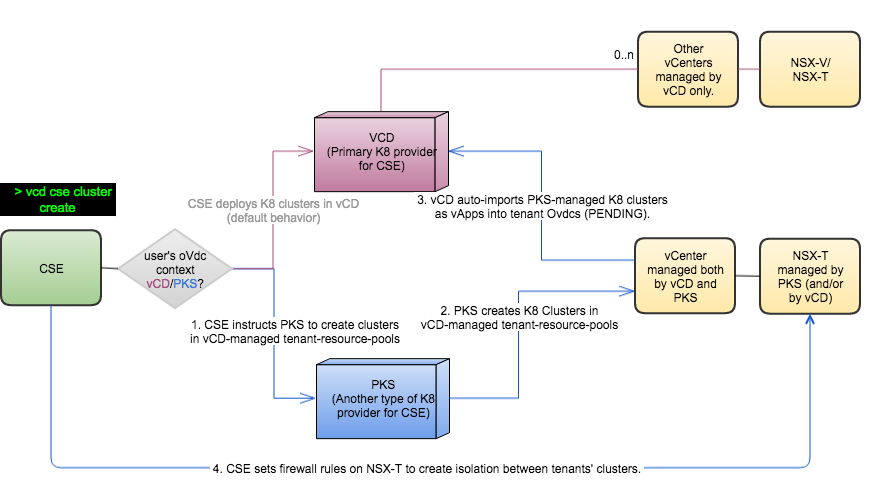

# Enterprise-PKS enablement

## Overview
CSE 2.0 begins to support K8 cluster deployment not only on vCD (native) but also on Enterprise-PKS servers. In other words, CSE lets cloud admins to choose a K8-provider for a given vdc in vCD and K8-provider has to be either vCD(native) (or) Enterprise-PKS. This page talks in detail about CSE-PKS architecture, configuration steps, tenant commands among others.

## Architecture
### Logical view of CSE

### Logical view of vCD datacenters

### End-to-end communication flow between CSE and K8-Providers

## Assumptions

## Recommendations

## Persona based workflows
### Service-provider (Cloud admin)
### Tenant-user

## FAQ
