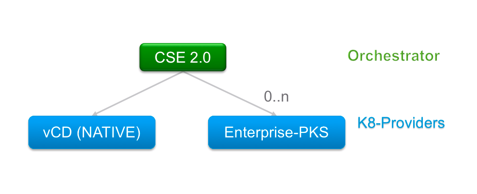
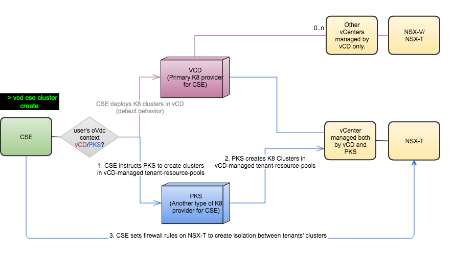
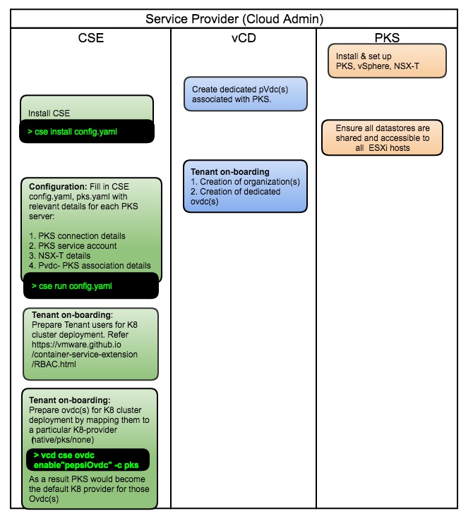
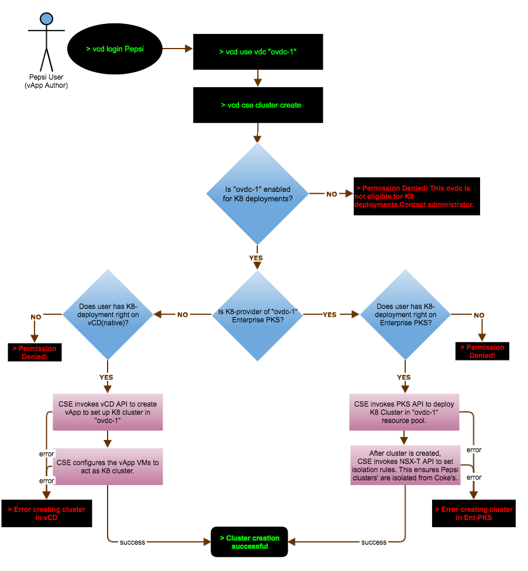

# Enterprise-PKS enablement
<a name="overview"></a>
## Overview
CSE 2.0 orchestrates K8 cluster deployment not only on vCD (native) but 
also on Enterprise-PKS servers.  
* Facilitates co-existence of vCD(native) and PKS clusters with in the same tenant boundaries.
* Enforces tenant isolation among PKS-deployed K8 clusters.
* Provides flexibility for admins to enable/disable a given vdc of tenant with a 
particular K8-provider (native | ent-pks | none).

This page talks in detail about CSE-PKS architecture, infrastructure set-up, 
configuration steps and tenant commands among others.

<a name="architecture"></a>
## Architecture

<a name="conceptual-view"></a>
### Conceptual view

<a name="communication-view"></a>

### Communication flow between CSE, VCD and PKS
Below diagram outlines the communication flow between various components involved 
for a create-cluster operation. Communication path in pink color illustrates 
work-flow of native K8 deployments and the path in blue illustrates work-flow of
PKS K8 deployments.
Refer [tenant-workflow](#tenant-workflow) to understand the below decision 
box in grey color in detail.


<a name="infra-view"></a>
### Infrastructure set-up and Tenant on-boarding

Below architectural and time-line views depict infrastructure set-up and tenant
 on-boarding. Cloud-provider has to essentially do below steps before 
 users can begin to create PKS-K8-deployments.
 1. Set up one or more PKS-vSphere-NSX-T instances.
 2. On-board PKS instances in vCD by creating corresponding provider-vdc(s).
 3. Install and configure CSE with vCD and PKS details. Start CSE server.
    * "CSE install" command prepares NSX-T(s) of PKS instances for tenant isolation.
 4. Tenant on-boarding 
    * Create ovdc(s) in vCD
    * Grant K8 deployment rights to chosen tenants and tenant-users. Refer 
    [RBAC feature](/RBAC.html) for more details
    * Enable ovdc(s) with a chosen K8-provider (native|ent-pks|none).
 

#### Architectural view

#### Timeline view


<a name="tenant-workflow"></a>
### Tenant workflow of create-cluster operation


<a name="persona-based-workflows"></a>
## Persona based commands
### Cloud-provider
#### Tenant on-boarding

**Granting rights to Tenants and Users:**

Below steps of granting rights are required only if [RBAC feature](/RBAC.html) is turned on.

```sh
* vcd right add "{cse}:CSE NATIVE DEPLOY RIGHT" -o tenant1
* vcd right add "{cse}:CSE NATIVE DEPLOY RIGHT" -o tenant2
* vcd right add "{cse}:PKS DEPLOY RIGHT" -o tenant1
```
```sh
* vcd role add-right "Native K8 Author" "{cse}:CSE NATIVE DEPLOY RIGHT"
* vcd role add-right "PKS K8 Author" "{cse}:PKS DEPLOY RIGHT"
* vcd role add-right "Omni K8 Author" "{cse}:CSE NATIVE DEPLOY RIGHT"
* vcd role add-right "Omni K8 Author" "{cse}:PKS DEPLOY RIGHT"
```
```sh
* vcd user create 'native-user' 'password' 'Native K8 Author'
* vcd user create 'pks-user' 'password' 'PKS K8 Author'
* vcd user create 'power-user' 'password' 'Omni K8 Author'
```

**Enabling ovdc(s) for a particular K8-provider:**

```sh
* vcd cse ovdc list
* vcd cse ovdc enable ovdc1 -o tenant1 -k native
* vcd cse ovdc enable ovdc2 -o tenant1 -k ent-pks --pks-plan "gold" --pks-cluster-domain "tenant1.com"
* vcd cse ovdc enable ovdc1 -o tenant2 -k native
```

### Tenant/Admin operations
```sh
* vcd cse cluster list
* vcd cse cluster create
* vcd cse cluster info
* vcd cse cluster resize
* vcd cse cluster delete
```
<a name="assumptions"></a>
## Assumptions
* Fresh Ent-PKS (vSphere & NSX-T) setup. PKS instances should not have any prior K8 deployments.
* CSE, vCD and Ent-PKS instances in the same management network.
* PKS service accounts with minimum required privileges for CRUD on clusters.

<a name="recommendations"></a>
## Recommendations
* Dedicated provider-vdc(s) for PKS K8 deployments.
* Dedicated org-vdc(s) for PKS K8 deployments.

<a name="known-issues"></a>
## Known issues

* "node info" on native K8 clusters may not work as expected. 
* "create cluster" on native ovdc(s) may not work as expected if executed by sysadmin.
* "cluster info" and "cluster list" may not work as expected for PKS clusters 
on which "resize" operation has been previously executed - PKS bug.

Fixes will be coming soon for the above.

<a name="faq"></a>
## FAQ

* Are Ent-PKS clusters visible in vCD UI?
    * Not yet. Ent-PKS clusters can only be managed via CSE-CLI as of today.
* Do Ent-PKS clusters adhere to their parent ovdc compute settings?
    * Yes. Both native and Ent-Pks clusters' combined usage is accounted towards 
    reaching compute-limits of a given ovdc resource-pool.
* Are Ent-PKS clusters isolated at network layer?
    * Yes. Tenant-1 clusters cannot reach Tenant-2 clusters via Node IP addresses.
* Do Ent-PKS clusters adhere to its parent ovdc storage limits?
    * Not yet. As of today, ovdc storage limits apply only for native K8 clusters.
* Can native K8 clusters be deployed in ovdc(s) dedicated for Ent-PKS?
    * Not yet.
* Can tenant get a dedicated storage for their Ent-PKS clusters?
    * Not yet. Support for this will be added as soon as Ent-PKS supports the 
    concept of storage-profiles. 
* Why is response-time of commands slower sometimes?
    * [RBAC feature](/RBAC.html) turned on will have some performance effect.
    * Presence of Ent-PKS instances in the system will have some performance 
    impact, as it involves invocation of multiple external API calls 
    and post-processing of data.
    * cluster-management commands by *sys-admin* may be even slower given CSE 
    has to scan entire system to generate results.
    * Performance-optimization will be coming soon.
* How to fix CSE time-out errors?
    * By increasing the vCD extension timeout to a higher value.
    * Refer to "Setting the API Extension Timeout" in [here](/CSE_ADMIN.html)