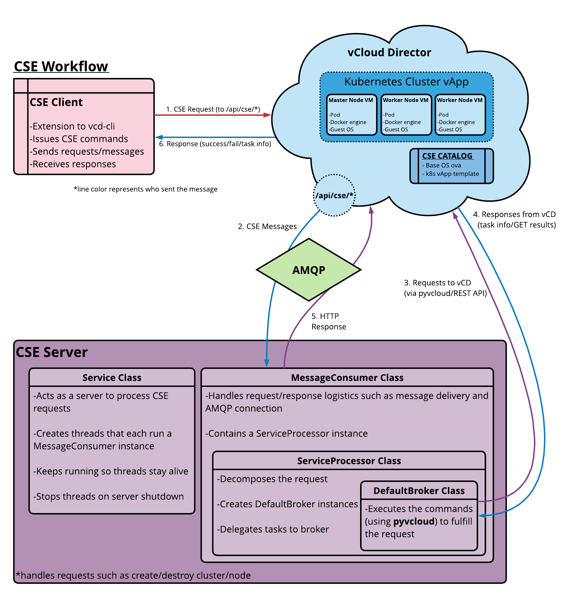

# Introduction

## Overview

Container Service Extension (CSE) is a VMware vCloud Director
extension that helps tenants create and work with Kubernetes clusters.

CSE brings Kubernetes-as-a-service to vCD by creating customized
VM templates and enabling tenant/organization administrators to
deploy fully functional Kubernetes clusters in self-contained vApps.

## How CSE Works

CSE has a server that installs as a vCloud Director extension.  It
adds API calls to vCloud Director that allows clients to create
Kubernetes clusters in vApps.  The following diagram illustrates
component interactions.

## CSE User Types

**Cloud administrators** handle setting up vCD, CSE config
file, CSE Server, and VM templates.  Cloud administrators are expected to
have background in vCD administration as well as sysadmin privileges.

Once CSE Server is running and VM templates are available, **tenant
organization administrators and users** can use CSE client (``vcd-cli``)
to handle Kubernetes cluster management. This includes deploying
clusters, adding worker nodes, configuring NFS storage, and the
like.

Tenant users who manage Kubernetes clusters are expected to understand
vCloud Director org administration principles. They should have
accounts with privileges required to create vApps and manage them.
Finally, such users should understand Kubernetes cluster management
including setting up user access and defining persistent volumes.

**Developers and other Kubernetes users** interact with CSE Kubernetes
clusters using ``kubectl`` For these users, Kubernetes clusters
work like any other Kubernetes cluster implementation. No special
knowledge of vCloud Director or CSE administration is required.
Such users do not even need a vCloud Director account.

