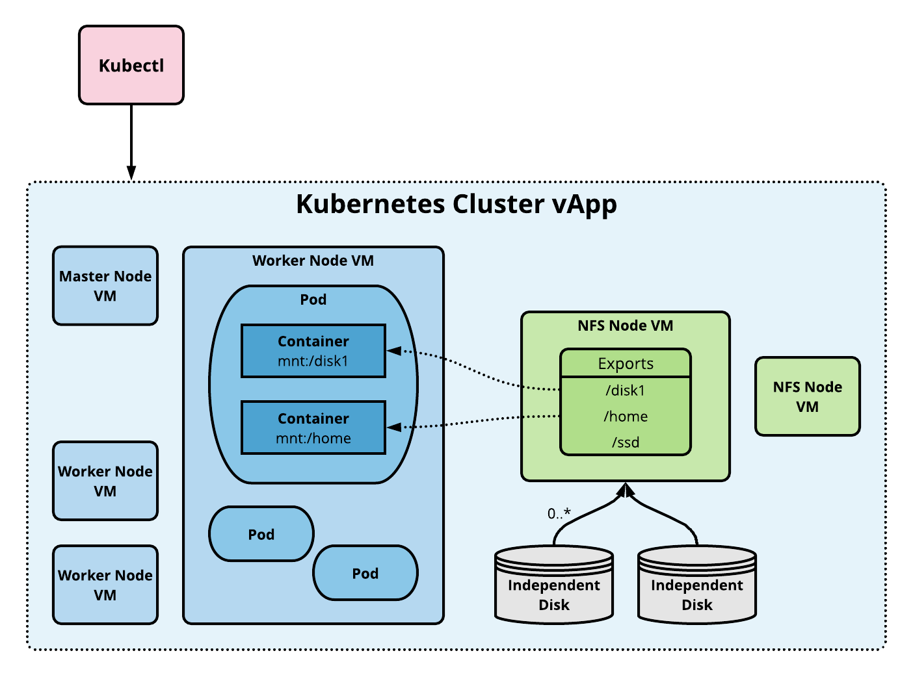

# **CSE: NFS-based Static Persistent Volumes**
[back to main CSE page](README.md#nfs)

CSE now enables users to deploy stateful applications on vCD Kubernetes clusters by leveraging static persistent volumes backed by an NFS server.

---
## **Static vs. Dynamic Persistent Volumes**
[Static PVs](https://kubernetes.io/docs/concepts/storage/persistent-volumes/#static) are pre-provisioned by cluster administrator. They carry the details of the real storage which is available for use by cluster users. They exist in the Kubernetes API and are available for consumption.

[Dynamic PVs](https://kubernetes.io/docs/concepts/storage/persistent-volumes/#dynamic) are not pre-provisioned by cluster administrator. When none of the static PVs match a user’s PersistentVolumeClaim, the cluster may try to dynamically provision a volume for the PVC.

### Static NFS volumes

An nfs volume allows an existing NFS (Network File System) share to be mounted into your pod. When a Pod is removed, the contents of an nfs volume are preserved and the volume is merely unmounted. This means that an NFS volume can be pre-populated with data, and that data can be “handed off” between pods. NFS can be mounted by multiple writers simultaneously. However, we need to have our own NFS server running with the share exported. CSE provides commands to add pre-configured NFS server(s) to any given cluster and more.

---
## **Architecture**



---
## **Sample CSE and/or NFS commands**

### Cloud/System Administrator

```shell
    CSE setup & configuration
        cse install -c config.yaml
    Start CSE server
        cse run -c config.yaml
```
<br>

### Tenant/Organization Administrator

```shell
    Create K8 Cluster with 2 worker nodes and 1 nfs server
        vcd cse cluster create mycluster -N 2 -n mynetwork -t ubuntu-16.04 --enable-nfs
    Add  1 nfs server (node of type NFS) to the existing K8 cluster
        vcd cse node create mycluster -N 1 -n mynetwork -t ubuntu-16.04 --type nfsd
    Get IP of the NFS server(s) & shares exposed (in a given cluster)
        vcd cse cluster info mycluster
    Create NFS persistent volume(s)
        kubectl create -f nfs_pv.yaml
        kubectl get pv
```
<br>

### App Developer

```shell
    Tell Kubectl about the K8 cluster whereabouts
        vcd cse cluster config mycluster > ~/.kube/config
    Create NFS persistent volume claim
        kubectl create -f nfs_pvc.yaml
        kubectl get pvc
    Launch 2 pods of busybox application instances writing to the NFS volume
        kubectl create -f nfs_busybox.yaml
        kubectl get rc
        kubectl get pods
```
<br>

### Sample declarative K8 yaml specs to create and use NFS volumes
#### Create NFS persistent volume
```shell
apiVersion: v1
kind: PersistentVolume
metadata:
  name: nfs
spec:
  capacity:
    storage: 1Gi
  accessModes:
    - ReadWriteMany
  nfs:
    # FIXME: use the right IP of NFS server
    server: 10.150.211.68
    path: "/home"
```
#### Create NFS persistent volume claim
```shell
apiVersion: v1
kind: PersistentVolumeClaim
metadata:
  name: nfs-pvc
spec:
  accessModes:
    - ReadWriteMany
  storageClassName: ""
  resources:
    requests:
      storage: 1Gi
```
#### Create application using NFS volumes
```shell
apiVersion: v1
kind: ReplicationController
metadata:
  name: nfs-busybox
spec:
  replicas: 2
  selector:
    name: nfs-busybox
  template:
    metadata:
      labels:
        name: nfs-busybox
    spec:
      containers:
      - image: busybox
        command:
          - sh
          - -c
          - 'while true; do date > /mnt/index.html; hostname >> /mnt/index.html; sleep $(($RANDOM % 5 + 5)); done'
        imagePullPolicy: IfNotPresent
        name: busybox
        volumeMounts:
          # name must match the volume name below
          - name: nfs
            mountPath: "/mnt"
      volumes:
        - name: nfs
          persistentVolumeClaim:
            claimName: nfs-pvc
```
---
## **FAQ**
- What is the difference between persistent volume (PV) and persistent volume claim (PVC)?
    - Static PV is a ready-to-use storage space created by K8 cluster admin. PVC is the storage requirement specified by the user. Kubernetes dynamically binds/unbinds PVC to PV at runtime. Learn more [here](https://kubernetes.io/docs/concepts/storage/persistent-volumes/#static)
- How are NFS exports mounted to containers?
    - Once a PV backed by NFS is created by K8 cluster admin, Kubernetes mounts specified NFS exports to pods and containers.