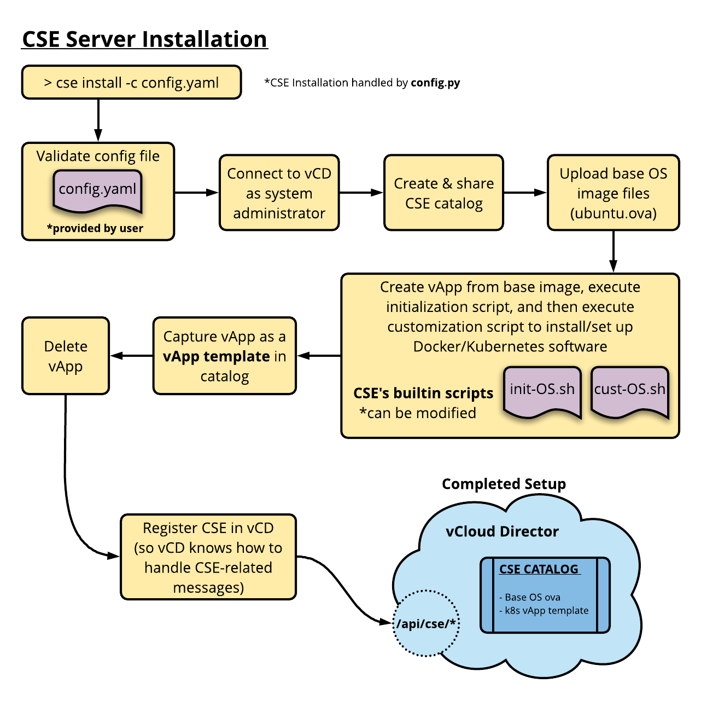
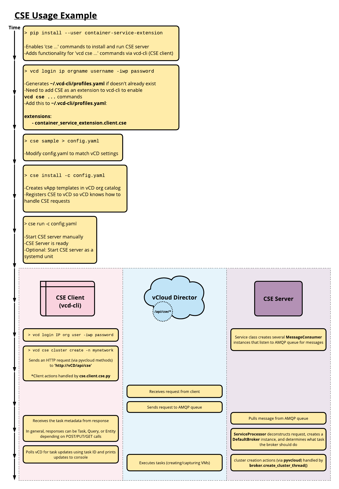

Container Service Extension (CSE) is a VMware vCloud Director extension that helps tenants create and work with Kubernetes clusters.

# **Table of Contents** <a name="toc"></a> 
(Section titles link back to table of contents)
- [Overview](#overview)
- [Getting CSE](#gettingcse)
- [Enabling CSE Client Commands in vcd-cli](#enableclient)
- [System/Cloud Administrator](#sysadmin)
    - [CSE/vCD Compatibility](#compatibility)
    - [Config File](#configfile)
    - [VM Templates](#vmtemplates)
    - [CSE Server](#cseserver)
        - [Installing CSE Server](#installingcseserver)
        - [Operating CSE Server](#operatingcseserver)
        - [Maintaining CSE Server](#maintainingcseserver)
    - [Useful Commands](#commandssysadmin)
- [Tenant/Organization Administrator and Other Users](#otherusers)
    - [Useful Commands](#commandstenantadmin)
    - [Automation](#automation)
    - [Example Use Case](#example)
- [NFS-based Static Persistent Volumes](#nfs)
- [CSE Example Use Case](#cseusage)
- [Troubleshooting](#troubleshooting)
- [Known Issues](#knownissues)
- [Contributing Guide](#contributing)
- [Release Notes](#releasenotes)

---
---
# [**Overview**](#toc) <a name="overview"></a>

CSE brings Kubernetes as a service to vCD by creating customized VM templates and enabling tenant/organization administrators to deploy fully functional Kubernetes clusters.

**System/cloud administrators** handle setting up vCD, CSE config file, CSE Server, and VM templates. 

Once CSE Server is running and VM templates are available, **tenant/organization administrators and users** can use CSE client (**vcd-cli**) to handle Kubernetes cluster management (deploying clusters, adding worker nodes/NFS nodes/disks/etc)


---
---
# [**Getting CSE**](#toc) <a name="gettingcse"></a>

Install Python 3.6 or greater. Pip, Python's package manager, should come with Python.
- https://realpython.com/installing-python/
- https://vmware.github.io/vcd-cli/install.html

Verify python and pip installation: 
```sh
> python3 --version
Python 3.7.0

> pip3 --version
pip 18.0 from /usr/local/lib/python3.7/site-packages/pip (python 3.7)
```
<br>

Install and verify CSE:
```sh
> pip3 install container-service-extension
...

> cse version
CSE, Container Service Extension for VMware vCloud Director, version 1.2.0
```
<br>

Alternatively, a specific version of CSE can be installed from GitHub

```sh
> pip3 install git+https://github.com/vmware/container-service-extension.git@1.2.0
```
All CSE versions on GitHub: https://github.com/vmware/container-service-extension/tags

---
---
# [**Enabling CSE Client Commands in vcd-cli**](#toc) <a name="enableclient"></a>

CSE client is not enabled yet:
```sh
> vcd cse version
Error: No such command "cse".
```
<br>

Edit `~/.vcd-cli/profiles.yaml` to include this section:
```
extensions:
- container_service_extension.client.cse
```
<br>

If `~/.vcd-cli/profiles.yaml` doesn't exist, logging in to vCD via **vcd-cli** will create it
```bash
> vcd login IP ORGNAME USERNAME -iwp PASSWORD
```
<br>

Verify that CSE client works:
```sh
> vcd cse version
CSE, Container Service Extension for VMware vCloud Director, version 1.2.0
```
---
---
# [**System/Cloud Administrator**](#toc) <a name="sysadmin"></a>

## [**CSE/vCD Compatibility**](#toc) <a name="compatibility"></a>

| CSE version | vCD version         |
|-------------|---------------------|
| 1.1.0       | 8.20, 9.0, 9.1      |
| 1.2.0       | 8.20, 9.0, 9.1, 9.5 |

---
## [**Config File**](#toc) <a name="configfile"></a>
Generate a skeleton config yaml file:
```sh
> cse sample > config.yaml
```
Edit this file with values from your vCloud Director

<br>

Config file has 5 sections: `amqp`, `vcd`, `vcs`, `service`, `broker`
### **amqp** section
CSE Server will communicate with vCD using these settings

During CSE Server installation, CSE can configure vCD's AMQP settings to match these settings

<br>

### **vcd** section
It's recommended to create a service account for vCD with minimum required privileges. An attacker getting credentials for a user account with admin-level privileges can be catastrophic

Minimum set of rights required by a service account to install CSE properly (subject to change with new vCD versions):
- Catalog: CLSP Publish Subscribe
- Catalog: Create / Delete a Catalog
- Catalog: Edit Properties
- Catalog: Import Media from vSphere
- Catalog: Publish
- Catalog: Sharing
- Catalog: View ACL
- Catalog: View Private and Shared Catalogs
- Catalog: View Published Catalogs
- Cell Configuration: View
- Disk: Change Owner
- Disk: Create
- Disk: Delete
- Disk: Edit Properties
- Disk: View Properties
- General: Administrator View
- General: View Error Details
- Host: View
- Organization Default Settings: View default settings for new Organizations.
- Organization Network: Open in vSphere
- Organization Network: View
- Organization vDC Network: View Properties
- Organization vDC Resource Pool: Open in vSphere
- Organization vDC Resource Pool: View
- Organization vDC Storage Policy: Open in vSphere
- Organization vDC: Extended View
- Organization vDC: View
- Organization vDC: View ACL
- Organization: View
- System Operations: Execute System Operations
- Task: Resume, Abort, or Fail
- Task: Update
- VAPP_VM_METADATA_TO_VCENTER
- VDC Template: Instantiate
- VDC Template: View
- vApp Template / Media: Copy
- vApp Template / Media: Create / Upload
- vApp Template / Media: Edit
- vApp Template / Media: View
- vApp Template: Checkout
- vApp Template: Download
- vApp Template: Import
- vApp Template: Open in vSphere
- vApp: Allow All Extra Config
- vApp: Allow Ethernet Coalescing Extra Config
- vApp: Allow Latency Extra Config
- vApp: Allow Matching Extra Config
- vApp: Allow NUMA Node Affinity Extra Config
- vApp: Change Owner
- vApp: Copy
- vApp: Create / Reconfigure
- vApp: Delete
- vApp: Download
- vApp: Edit Properties
- vApp: Edit VM CPU
- vApp: Edit VM CPU and Memory reservation settings in all VDC types
- vApp: Edit VM Hard Disk
- vApp: Edit VM Memory
- vApp: Edit VM Network
- vApp: Edit VM Properties
- vApp: Enter/Exit Maintenance Mode
- vApp: Import Options
- vApp: Manage VM Password Settings
- vApp: Open in vSphere
- vApp: Power Operations
- vApp: Shadow VM View
- vApp: Sharing
- vApp: Snapshot Operations
- vApp: Upload
- vApp: Use Console
- vApp: VM Boot Options
- vApp: VM Check Compliance
- vApp: VM Migrate, Force Undeploy, Relocate, Consolidate
- vApp: View ACL
- vApp: View VM metrics
- vCenter: Open in vSphere
- vCenter: Refresh
- vCenter: View


Always ensure vCD service account has enough privileges. Alternatively, you can create a role with Admin privileges and deselect/delete rights which are not required.

<br>

`vcd` section has the following properties:

| Property          | Value                                                                                           |
|:------------------|:------------------------------------------------------------------------------------------------|
| host            | IP or hostname of the vCloud Director                                                           |
| username        | Username of the vCD service account with minimum roles and rights                               |
| password        | Password of the vCD service account.                                                             |

<br>

### **vcs** section
Guest Operations Privileges required for vCenter service account:
- Guest Operation Program Execution
- Guest Operation Modifications
- Guest Operation Queries

<br>

Each `vc` under `vcs` section has the following properties:

| Property          | Value                                                                                           |
|:------------------|:------------------------------------------------------------------------------------------------|
| name            | Name of the vCenter registered in vCD                                                                           |
| username        | Username of the vCenter service account with minimum of guest-operation privileges.             |
| password        | Password of the vCenter service account.                                                        |

<br>

### **service** section
Specify how many threads you want CSE Server to create.

<br>

### **broker** section
`broker` section has the following properties:

| Property           | Value                                                                                                                                                                                                                |
|:--------------------|:----------------------------------------------------------------------------------------------------------------------------------------------------------------------------------------------------------------------|
| type               | Broker type, set to `default`                                                                                                                                                                                        |
| org                | vCD organization that contains the shared catalog where the master templates will be stored                                                                                                                          |
| vdc                | Virtual datacenter within `org` that will be used during the install process to build the template                                                                                                                   |
| network            | Org Network within `vdc` that will be used during the install process to build the template. It should have outbound access to the public Internet. The `CSE` appliance doesn't need to be connected to this network |
| ip_allocation_mode | IP allocation mode to be used during the install process to build the template. Possible values are `dhcp` or `pool`. During creation of clusters for tenants, `pool` IP allocation mode is always used              |
| catalog            | Public shared catalog within `org` where the template will be published                                                                                                                                              |
| cse_msg_dir        | Reserved for future use                                                                                                                                                                                              |
| storage_profile    | Name of the storage profile to use when creating the temporary vApp used to build the template                                                                                                                       |
| default_template   | Name of the default template to use if none is specified                                                                                                                                                             |
| templates          | A list of templates available for clusters                                                                                                                                                                           |

Each `template` in the `templates` property has the following properties:

| Property          | Value                                                                                                                                                                                                             |
|:------------------|:------------------------------------------------------------------------------------------------------------------------------------------------------------------------------------------------------------------|
| name            | Unique name of the template                                                                                                                                                                                       |
| source_ova      | URL of the source OVA to download                                                                                                                                                                                 |
| sha256_ova        | sha256 of the source OVA                                                                                                                                                                                            |
| source_ova_name | Name of the source OVA in the catalog                                                                                                                                                                             |
| catalog_item    | Name of the template in the catalog                                                                                                                                                                               |
| description     | Information about the template                                                                                                                                                                                    |
| temp_vapp       | Name of the temporary vApp used to build the template. Once the template is created, this vApp can be deleted. It will be deleted by default during the installation based on the value of the `cleanup` property |
| cleanup         | If `True`, `temp_vapp` will be deleted by the install process after the master template is created                                                                                                                |
| admin_password  | `root` password for the template and instantiated VMs. This password should not be shared with tenants                                                                                                            |
| cpu             | Number of virtual CPUs to be allocated for each VM                                                                                                                                                                |
| mem             | Memory in MB to be allocated for each VM                                                                                                                                                                          |

---
## [**VM Templates**](#toc) <a name="vmtemplates"></a>
`CSE` supports multiple VM templates to create Kubernetes clusters from. Templates may vary in guest OS or software versions, and must have a unique name. One template must be defined as the default template, and tenants have the option to specify the template to use during cluster/node creation.

### **Source .ova Files for VM Templates**

| OS                   | OVA Name                               | URL                                                                                                       | SHA256                                                           |
|----------------------|----------------------------------------|-----------------------------------------------------------------------------------------------------------|------------------------------------------------------------------|
| Photon OS 1.0, Rev 2 | photon-custom-hw11-1.0-62c543d.ova     | `https://bintray.com/vmware/photon/download_file?file_path=photon-custom-hw11-1.0-62c543d.ova`            | 6d6024c5531f5554bb0d2f51f3005078ce6d4ee63c142f2453a416824c5344ca |
| Photon OS 2.0 GA     | photon-custom-hw11-2.0-304b817.ova     | `http://dl.bintray.com/vmware/photon/2.0/GA/ova/photon-custom-hw11-2.0-304b817.ova`                       | cb51e4b6d899c3588f961e73282709a0d054bb421787e140a1d80c24d4fd89e1 |
| Ubuntu 16.04.4 LTS   | ubuntu-16.04-server-cloudimg-amd64.ova | `https://cloud-images.ubuntu.com/releases/xenial/release-20180418/ubuntu-16.04-server-cloudimg-amd64.ova` | 3c1bec8e2770af5b9b0462e20b7b24633666feedff43c099a6fb1330fcc869a9 |

<br>

### **Updating VM Templates**
CSE Server should be gracefully stopped before updating VM templates, to avoid errors that can occur when using `vcd cse cluster create ...` or `vcd cse node create ...`

In general, updating a template doesn't have any effect on existing Kubernetes master and worker nodes. CSE and template compatibility can be found in release notes.

Templates can also be generated on a vCD instance that CSE Server is not registered to. Templates can be generated in multiple vCD instances in parallel.

<br>

Update a template:
```sh
> cse install -c config.yaml --template photon-v2 --update --amqp skip --ext skip
```
<br>

Updating a template increases `versionNumber` of the corresponding catalog item by 1:
```sh
> vcd catalog info cse photon-custom-hw11-2.0-304b817-k8s
```
---
## [**CSE Server**](#toc) <a name="cseserver"></a>
### [**Installing CSE Server**](#toc) <a name="installingcseserver"></a>

`CSE` Server should be installed by the vCloud Director System/Cloud Administrator on a new VM or one of the existing servers that are part of vCD. This CSE VM is the **CSE appliance**.

CSE appliance requires network access to the vCD cell, vCenter(s), and AMQP server.

CSE appliance does not require access to the network(s) where the Kubernetes templates will be created (`network` and `temp_vapp` config file properties) or the tenant network(s) where the clusters will be created.

`cse install` command supports the following options:

| Option       | Short | Argument(s)              | Description                                                                                                                                                | Default Value                                 |
|:--------------|:-------|:--------------------------|:------------------------------------------------------------------------------------------------------------------------------------------------------------|:-----------------------------------------------|
| --config     | -c    | path/to/config.yaml      | Config file to use                                                                                                                                         | config.yaml                                   |
| --template   | -t    | template-name            | Install the specified template                                                                                                                             | '*' (installs all templates specified in config file) |
| --update     | -u    | n/a                      | Recreate templates during installation                                                                                                                     | False                                         |
| --no-capture | -n    | n/a                      | Don't capture the temporary vApp as a template   (Leaves it standing for debugging purposes)                                                               | False                                         |
| --ssh-key    | -k    | path/to/ssh-key.pub      | ssh-key file to use for vm access   (root password ssh access is disabled for security reasons)                                                            | None                                          |
| --amqp       | -a    | prompt OR skip OR config | **prompt**: ask before configuring AMQP settings<br>**skip**: do not configure AMQP settings<br>**config**: configure AMQP without asking for confirmation | prompt                                        |
| --ext        | -e    | prompt OR skip OR config | **prompt**: ask before registering CSE<br>**skip**: do not register CSE<br>**config**: register CSE without asking for confirmation                        | prompt                                        |

<br>

To monitor the vApp customization process, you can ssh into the temporary vApp. In the temporary vApp, the output of the customization script is captured in `/tmp/FILENAME.out` as well as `/tmp/FILENAME.err`:
```sh
# print out file contents as it's being written to
> tail -f /tmp/FILENAME.out
> tail -f /tmp/FILENAME.err
```

The temporary vApp guest OS does not allow root ssh access via password for security reasons (use `--ssh-key` option to provide a public key).

To inspect the temporary vApp after customization, use the `--no-capture` option (also requires the `--ssh-key` option):
```sh
> cse install -c config.yaml --no-capture --ssh-key ~/.ssh/id_rsa.pub
```
<br>



#### **Validate CSE Installation**
Validate that CSE has installed correctly with:

```sh
> cse check --config config.yaml --check-install
```
The `cse check` command supports the following options:

| Option          | Short | Argument(s)         | Description                                                           | Default                                                 |
|-----------------|-------|---------------------|-----------------------------------------------------------------------|---------------------------------------------------------|
| --config        | -c    | path/to/config.yaml | Config file to use                                                    | config.yaml                                             |
| --check-install | -i    | n/a                 | Check CSE installation on vCD                                         | False                                                   |
| --template      | -t    | template-name       | If `--check-install` is set, check that the specified template exists | '*' (checks for all templates specified in config file) |

<br>

Validate that CSE has been registered in vCD
Using `vcd-cli`, check that the extension has been registered in vCD:

```sh
# login as system administrator
> vcd login vcd.serviceprovider.com System administrator --password passw0rd -w -i

# list extensions
> vcd system extension list

# get details of CSE extension
> vcd system extension info cse
```
<br>

#### **Optional**
Configure the API extension timeout (seconds) on the vCloud Director cell:
```sh
> cd /opt/vmware/vcloud-director/bin
> ./cell-management-tool manage-config -n extensibility.timeout -l
> ./cell-management-tool manage-config -n extensibility.timeout -v 20
```
<br>

Manually register CSE api extension to vCD:
```sh
> vcd system extension create cse cse cse vcdext '/api/cse, /api/cse/.*, /api/cse/.*/.*'
```
---
### [**Operating CSE Server**](#toc) <a name="operatingcseserver"></a>
`CSE` Server uses threads to process requests. The number of AMQP listener threads can be configured in the config file with `listeners` property under `service` section (default is 5).

#### **Running CSE Server Manually**
```sh
> cse run --config config.yaml

# run server in the background
> nohup cse run --config config.yaml > nohup.out 2>&1 &
```
Server output log can be found in `cse.log`

<br>

#### **Running CSE Server as a Service**
A sample `systemd` unit is provided by CSE. Copy file `cse.service` from where CSE is installed to, and move it to `/etc/systemd/system/cse.service`. A sample `cse.sh` is also provided. (what does cse.sh does and is it used in this?)

CSE service daemon should be started using `systemctl start cse`. To enable, disable, and stop CSE service, use CSE client.
```sh
# hook CSE unit into relevant places to automatically do things
# depending on what's specified in the unit file
> vcd cse system enable

# start CSE service now
> systemctl start cse

# stop processing new requests, and finish processing existing requests
# disables CSE service
> vcd cse system disable
property    value
----------  -------
message     Updated

# wait until all active threads have finished, then exits CSE service
> vcd cse system stop -y
property    value
----------  ---------------------------------------------------------------------
message     CSE graceful shutdown started. CSE will finish processing 4 requests.

> vcd cse system info
property              value
--------------------  ------------------------------------------------------
all_threads           8
config_file           /Users/pgomez/vmware/cse/testbed-202-34.yaml
consumer_threads      5
description           Container Service Extension for VMware vCloud Director
product               CSE
python                3.6.4
requests_in_progress  4
status                Shutting down
version               1.2.0
```
<br>

If CSE Server is disabled, users will get the following message when executing any CSE command:

```bash
$ vcd cse cluster list
Usage: vcd cse cluster list [OPTIONS]

Error: CSE service is disabled. Contact the System Administrator.
```
<br>

#### **Monitoring CSE Service**
vCD System Administrator can monitor CSE service status via CSE client:
```sh
> vcd cse system info
property              value
--------------------  ------------------------------------------------------
all_threads           10
config_file           /opt/vmware/cse/testbed-202-34.yaml
consumer_threads      6
description           Container Service Extension for VMware vCloud Director
product               CSE
python                3.6.4
requests_in_progress  3
status                Running
version               1.2.0
```
<br>

On Photon OS, to keep the service running after logout, check `/etc/systemd/logind.conf` and set `KillUserProcesses` to `no`
```
[Login]
KillUserProcesses=no
```
<br>

System administrators can list all the clusters running in vCD with a search command using cluster vApp metadata:
```bash
> vcd search adminvapp -f 'metadata:cse.cluster.id!=STRING:'
```
---
### [**Maintaining CSE Server**](#toc) <a name="maintainingcseserver"></a>
When upgrading CSE versions, re-register the extension:
```sh
# remove previous registration of CSE
> vcd system extension delete cse

# run cse installation again
> cse install --config config.yaml
```
<br>

#### **Updating CSE Server**
- Gracefully stop CSE Server
- Reinstall `container-service-extension` from PyPI:
```bash
pip3 install --user --upgrade container-service-extension
```
- Check the release notes at the end of this document for version compatibility:
  - Review the configuration file for any new options introduced or deprecated in the new version
  - If the previously generated templates are not longer supported by the new version, delete the templates and re-generate new ones.
- If running CSE as a service, start the new version of the service with `systemctl start cse`
<br>

#### **Uninstalling CSE Server**
- Gracefully stop CSE Server
- As System Administrator, unregister CSE from vCD:
```sh
> vcd system extension delete cse
```
- Review vCD AMQP settings. May not require any modifications
```shell
> vcd system amqp info
```
- (Optional) Delete VM templates and the CSE catalog from vCD

---
## [**Useful Commands**](#toc) <a name="commandssysadmin"></a>
`cse ...` commands are used by system administrators to:
- Install CSE Server
- Create/update templates
- Run CSE Server manually

`vcd cse ...` commands are used by system administrators to:
- Monitor status of CSE Server and clusters
- Operate CSE as a service

```sh
### Use '-h' option to see help page and options for any command
> cse install --config config.yaml
> cse check --config config.yaml
> cse run --config config.yaml

# login to vCD to use vcd-cli commands
> vcd login IP system USERNAME -iwp PASSWORD

# set ORGNAME to be active org for this session
> vcd org use ORGNAME

# set VDCNAME to be active vdc for this session
> vcd vdc use VDCNAME
```
---
---
# [**Tenant/Organization Administrator and Other Users**](#toc) <a name="otherusers"></a>
Once CSE Server is installed and running, tenants can use CSE client ([vcd-cli](https://vmware.github.io/vcd-cli)) to create Kubernetes clusters on demand.

Master and worker nodes are VMs within a vApp on the tenant virtual datacenter. The VMs are required to be connected to an organization VDC network specified with the `--network` required command-line option. This network should have a static IP pool, and may require access to the internet if installing additional components.

<br>

## [**Useful Commands**](#toc) <a name="commandstenantadmin"></a>
`vcd cse ...` commands are used by tenant/org administrators and users to:
- list templates
- get CSE Server status
- create, list, and delete clusters/nodes

<br>

Summary of commands available to manage templates, clusters and nodes:

| Command                                           | Description                                     |
|:--------------------------------------------------|:--------------------------------------------|
| `vcd cse template list`                           | List available templates to create clusters |
| `vcd cse cluster create CLUSTER_NAME`           | Create a new Kubernetes cluster             |
| `vcd cse cluster create CLUSTER_NAME --enable-nfs`| Create a new Kubernetes cluster with NFS PV support.|
| `vcd cse cluster list`                            | List created clusters.                      |
| `vcd cse cluster delete CLUSTER_NAME`           | Delete a Kubernetes cluster.                |
| `vcd cse node create CLUSTER_NAME --nodes n`    | Add `n` nodes to a cluster.                 |
| `vcd cse node create CLUSTER_NAME --type nfsd`  | Add an NFS node to a cluster.               |
| `vcd cse node list CLUSTER_NAME`                | List nodes of a cluster.                    |
| `vcd cse node delete CLUSTER_NAME NODE_NAME` | Delete nodes from a cluster.                |

<br>

By default, CSE Client will display the task progress until the task finishes or fails. The `--no-wait` will return the task information, which you can use to monitor the task progress:
```sh
> vcd --no-wait cse cluster create CLUSTER_NAME --network intranet --ssh-key ~/.ssh/id_rsa.pub

# displays the status and progress of the task
> vcd task wait 377e802d-f278-44e8-9282-7ab822017cbd

# lists the current running tasks in the organization
> vcd task list running
```
---
## [**Automation**](#toc) <a name="automation"></a>
CSE can be easily scripted to automate the creation and operation of Kubernetes clusters and nodes.

Users can also interact with CSE via the Python package or the CSE API exposed in vCD. 

This Python script creates a Kubernetes cluster on vCloud Director:
```python
#!/usr/bin/env python3
from pyvcloud.vcd.client import BasicLoginCredentials
from pyvcloud.vcd.client import Client
from container_service_extension.client.cluster import Cluster

client = Client('vcd.mysp.com')
client.set_credentials(BasicLoginCredentials('usr1', 'org1', '******'))

cse = Cluster(client)
result= cse.create_cluster('vdc1', 'net1', 'cluster1')
task = client.get_resource(result['task_href'])
task = client.get_task_monitor().wait_for_status(task)
print(task.get('status'))

client.logout()
```
---
## [**Example Use Case**](#toc) <a name="example"></a>
```sh
# create cluster mycluster with one master and two nodes, connected to provided network
# a public key is provided to be able to ssh into the VMs
> vcd cse cluster create mycluster --network intranet --ssh-key ~/.ssh/id_rsa.pub

# list the worker nodes of a cluster
> vcd cse node list mycluster

# create cluster mycluster with one master, three nodes and connected to provided network
> vcd cse cluster create mycluster --network intranet --nodes 3 --ssh-key ~/.ssh/id_rsa.pub

# create a single worker node cluster, connected to the specified network. Nodes can be added later
> vcd cse cluster create mycluster --network intranet --nodes 0 --ssh-key ~/.ssh/id_rsa.pub

# create cluster mycluster with one master, three worker nodes, connected to provided network
# and one node of type NFS server
> vcd cse cluster create mycluster --network intranet --nodes 3 --ssh-key ~/.ssh/id_rsa.pub --enable-nfs

# add 2 worker nodes to a cluster with 4GB of ram and 4 CPUs each, from the photon-v2 template
# and using the specified storage profile
> vcd cse node create mycluster --nodes 2 --network intranet --ssh-key ~/.ssh/id_rsa.pub --memory 4096 --cpu 4 --template photon-v2 --storage-profile Development

# add 1 nfsd node to a cluster with 4GB of ram and 4 CPUs each, from the photon-v2 template
# and using the specified storage profile
> vcd cse node create mycluster --nodes 1 --type nfsd --network intranet --ssh-key ~/.ssh/id_rsa.pub --memory 4096 --cpu 4 --template photon-v2 --storage-profile Development

# info on a given node. If the node is of type nfsd, it displays info about Exports.
> vcd cse node info mycluster nfsd-dj3s

# delete 2 nodes from a cluster
> vcd cse node delete mycluster node-dj3s node-dj3s --yes

# list available clusters
> vcd cse cluster list

# info on a given cluster
> vcd cse cluster info

# retrieve cluster config
> vcd cse cluster config mycluster > ~/.kube/config

# check cluster configuration
> kubectl get nodes

# deploy a sample application
> kubectl create namespace sock-shop

> kubectl apply -n sock-shop -f "https://github.com/microservices-demo/microservices-demo/blob/master/deploy/kubernetes/complete-demo.yaml?raw=true"

# check that all pods are running and ready
> kubectl get pods --namespace sock-shop

# access the application
> IP=`vcd cse cluster list|grep '\ mycluster'|cut -f 1 -d ' '`
> open "http://${IP}:30001"

# delete cluster when no longer needed
> vcd cse cluster delete mycluster --yes
```
---
---
# [**NFS-based Static Persistent Volumes**](#toc) <a name="nfs"></a>

[Link](NFS_STATIC_PV.md)

---
---
 <a name="cseusage"></a>

---
---
## [**Troubleshooting**](#toc) <a name="troubleshooting"></a>
`cse.log` logs CSE Server activity. Server requests and responses are recorded here, as well as outputs of scripts that were run on VMs.

`cse-check.log` logs CSE operations, such as `cse install`. Stack traces and HTTP messages specific to CSE are recorded here.

`vcd.log` logs vcd-cli and pyvcloud activity. Stack traces and HTTP messages specific to vcd-cli are recorded here.

Common mistakes:
- Config file fields are incorrect
- Not logged in to vCD via vcd-cli
- Logged in to vCD via vcd-cli as wrong user or user without required permissions
- Config file and vCD should have same host/exchange, and make sure exchange exists on vCD
    - On server start, monitor with `tail -f cse.log`
- If CSE installation/updates failed, broken VMs/clusters/templates may exist, and CSE will not know that entities are invalid.
    - Remove these entities from vCD manually

---
---
## [**Known Issues**](#toc) <a name="knownissues"></a>
Failures during template creation during installation
- One of the template-creation scripts may have exited with an error
- One of the scripts may be hung waiting for a response
- If the VM has no internet access, scripts may fail
- Check CSE logs for script outputs

<br>

CSE service fails to start
- Workaround: rebooting the VM starts the service

<br>

CSE does not clean up after itself if something goes wrong. When CSE installation is aborted for any reason, ensure temporary vApp is deleted in vCD before re-issuing the install command
- Manually delete the problematic "ubuntu-temp" vApp.
- If temporary vApp still exists and `cse install` command is run again, CSE will just capture the vApp as the Kubernetes template, even though the vApp is not set up properly.
- Running CSE install with the `--update` option will remove this invalid vApp.

<br>

### **NFS-related Issues**
Currently, NFS servers in Kubernetes cluster can not only be accessed by nodes of that cluster but also by any VM (outside of the cluster) residing in the same orgVdc. Ideal solution is to have vApp network created for each Kubernetes cluster, which is in our road-map to implement. Until then, please choose one of below workarounds to avert this problem if the need arises.
- Give access to only master & worker nodes of the cluster by adding individual IPs of the nodes into /etc/exports file on NFS server.
    - Create and run a script periodically which retrieves IPs of nodes in the cluster and then add them to NFS server access list (/etc/exports).
    - eg: /home 203.0.113.256(rw,sync,no_root_squash,no_subtree_check) 203.0.113.257(rw,sync,no_root_squash,no_subtree_check)
- Admin can manually add a vApp network for each kubernetes cluster in vCD.
- Create a ssh tunnel from each worker node (using ssh local port forwarding) and then use 127.0.0.1:<port> in the  Kubernetes declarative specs as IP of the NFS server.
    - In NFS server, for any given shared directory, add below line to /etc/exports file.
        - /home localhost(insecure,rw,sync,no_subtree_check)
        - systemctl restart nfs-kernel-server.service
    - Copy ssh public key of each worker node into ~/.ssh/authorized_keys in NFS server
        - Client: Generate key using ssh-keygen and copy the contents of ~/.ssh/id_rsa.pub
        - NFS server: Paste the contents (public key) from client into ~/.ssh/authorized_keys
    - In each master/worker node,
        - apt-get install portmap
        - ssh -fNv -L 3049:127.0.0.1:2049 user@NFSServer
    - Read more about this approach here
        - http://www.debianadmin.com/howto-use-ssh-local-and-remote-port-forwarding.html
        - https://gist.github.com/proudlygeek/5721498

---
---
# [**Contributing Guide**](#toc) <a name="contributing"></a>

[Link](CONTRIBUTING.md)

---
---
# [**Release Notes**](#toc) <a name="releasenotes"></a>

[Link](RELEASE_NOTES.md)
