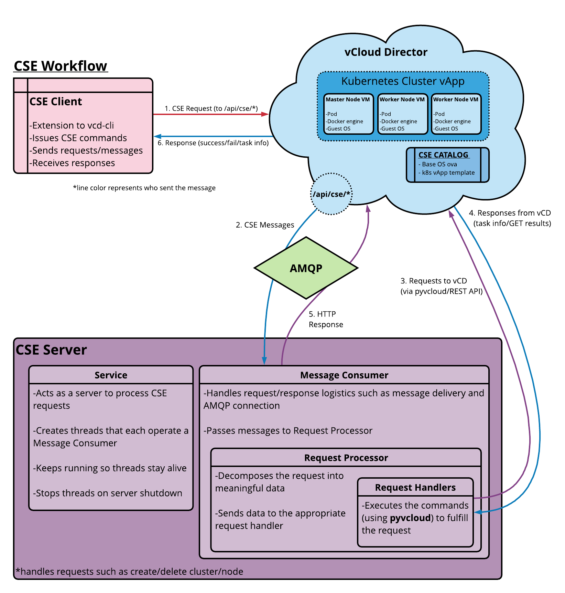
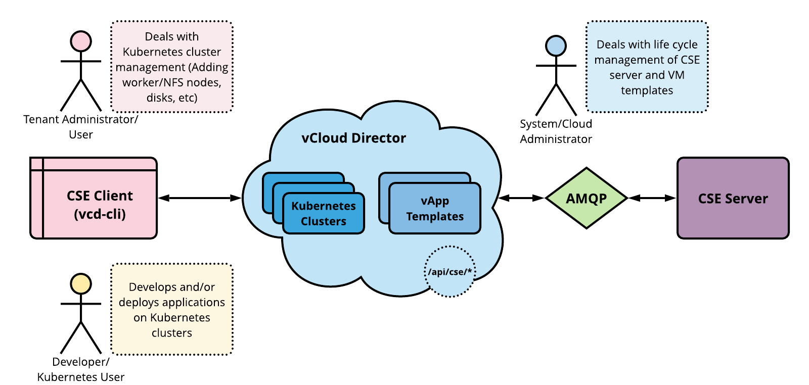
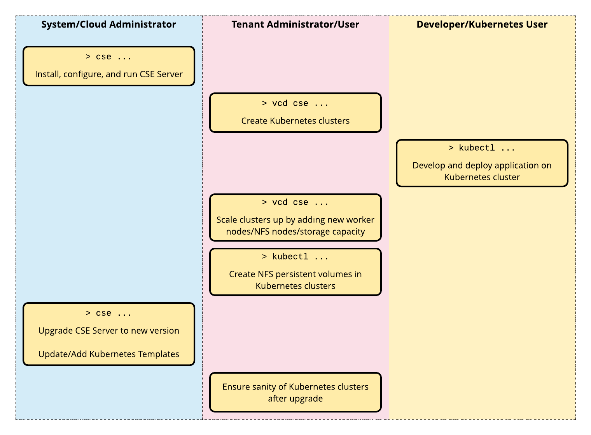

# Introduction for 2.6

## OverviewChanged

Container Service Extension (CSE) is a VMware vCloud Director (VCD)
extension that helps tenants create and work with Kubernetes clusters.

CSE brings _Kubernetes as a Service_ to VCD, by creating customized
VM templates (Kubernetes templates) and enabling tenant users to deploy fully functional
Kubernetes clusters as self-contained vApps.

## How CSE Works

CSE has a server component that installs as a VCD extension. It exposes REST
API endpoint points via VCD. CSE also has a client component that plugs in
``vcd-cli``, communicates with the CSE server via the exposed API endpoints, and
facilitates VCD users to create Kubernetes clusters in VCD. The following
diagram illustrates the interactions between the components.

## CSE User Types

**Cloud administrators** handle setting up VCD, CSE config
file, CSE Server, and Kubernetes templates. Cloud administrators are expected to
posses `sysadmin` privileges and as well as experience in VCD administration.

Once CSE Server is running and Kubernetes templates are available, **tenant
organization administrators and users** can use CSE client (``vcd-cli``)
to handle Kubernetes cluster management. This includes deploying
clusters, adding worker nodes, configuring NFS storage, and the
like.

Tenant users who manage Kubernetes clusters are expected to understand
VCD org administration principles. They should have accounts with privileges
required to create vApps and manage them. Finally, such users should understand
Kubernetes cluster management including setting up user access and
defining persistent volumes.

**Developers and other Kubernetes users** interact with CSE Kubernetes
clusters using ``kubectl`` For these users, Kubernetes clusters
work like any other Kubernetes cluster implementation. No special
knowledge of vCloud Director or CSE administration is required.
Such users do not even need a vCloud Director account.

