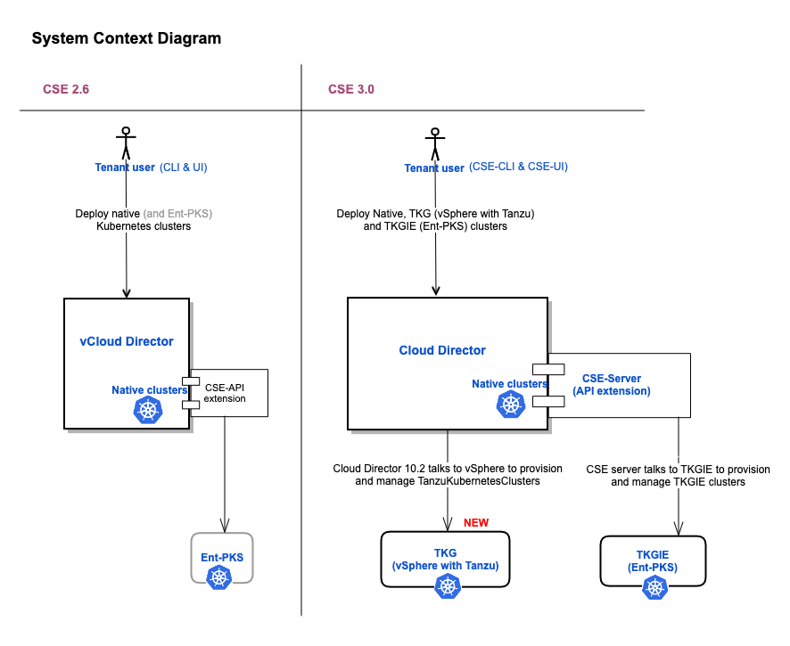

# What's new in CSE 3.0?

<a name="overview"></a>
## Overview
* CSE-CLI and CSE-UI can be used to manage Cloud Director provisioned Tanzu Kubernetes Clusters (link to vCD-vSphere with Tanzu documentation) alongside Native and TKGIE(Ent-PKS) clusters.
* CSE 3.0 has been architecturally redesigned to leverage the latest features of Cloud Director like the Defined entity framework. Native clusters are now represented as defined entities. Users will not see any difference in the functionality of native clusters, but the underlying implementation has been enhanced to leverage defined entities, thus adding some level of persistence to native clusters in vCD. In other words, users can now query native clusters using defined entity API.
* Separate command group for TKGI (Ent-PKS).



<a name="provider-workflows"></a>
## Provider workflows
### Compatibility matrix and relevant features

|CSE CLI | CSE UI                    | CSE Server | Cloud Director| Features offered | 
|------|------------------------------------------|----------------|-------|--------------------------|
|3.0 | 2.0     | NA            | 10.2 | Tkg cluster management only     |
|3.0 | 2.0 | 3.0            | 10.2 | Native, Tkg, and Ent-PKS Cluster management; Defined entity representation for both native and tkg. |
|3.0 | 2.0 | 3.0            | 10.1, 10.0 | Legacy features (Native and Ent-PKS cluster management) |

### CSE Server
#### Greenfield installation
With CSE 3.0, two additional steps are performed during the CSE installation (command: "cse install -c config.yaml")

* Prepares the environment for Providers to be able to perform organization VDC enablement for native clusters. Empty placement policy(s) are created at the global level, which will further be used in organization VDC enablement commands for native clusters. 
* Registers defined entity schema for native clusters. As a side effect, "cse:native cluster entitlement" right bundle gets created in the Cloud Director and all native cluster operations will be guarded by these rights.
Invoke this API to get a detailed view of defined entity schema for native clusters - https://<vcd-ip>/cloudapi/1.0.0/entityTypes/cse/nativeCluster/1.0.0

#### Brownfield upgrade
CSE 3.0 has been architecturally redesigned to leverage the latest features of Cloud Director like Defined entity framework and placement policies. The new command "cse upgrade" has been introduced to make the old environment fully forward compatible with the latest technologies used in CSE 3.0. The only valid upgrade path is CSE 2.6 → CSE 3.0; any versions below CSE 2.6 cannot be directly upgraded to CSE 3.0.

The command "cse upgrade" must be run to ensure the environment is forward compatible with CSE 3.0. The below steps will be performed during the upgrade. Please run the command "cse upgrade --help" for more details.

* Delete old compute policies in the environment: untag old templates with existing compute policies, unpublish existing compute policies from the organization virtual data center(s), delete the legacy compute policies.
* Prepare the environment to be able to perform organization virtual data center enablement for native clusters.
* Auto-install templates of the latest revision unless specified otherwise.
* Identify existing organization virtual datacenter(s) with existing clusters and publish appropriate placement policies on the same.
* Make legacy clusters forward compatible; create corresponding defined entities for all of the old clusters in the environment.

#### Tenant onboarding
The provider needs to perform below operations to enable Kubernetes cluster deployments in tenant organizations and tenant virtual data centers.
1. Native cluster operations are no longer gated by CSE API extension-specific rights as used in CSE 2.6.x. With the introduction of defined entity representation for native clusters, a new right bundle "cse:nativeCluster entitlement" is registered in Cloud Director during CSE Server installation, which is what guards the native cluster operations in CSE 3.0. The same is the case for Tkg clusters. 
Grant the Tkg cluster and Native cluster right bundles to the desired organizations and then grant the admin-level defined entity type rights to the Tenant Administrator role. This will enable the tenant administrator to grant the relevant cluster management rights to the desired tenant users. Users cannot view or deploy clusters unless they have one of the below-mentioned rights.  Link to Defined entity framework (or) how to read defined entity type rights.

    * Right bundle for Tkg Cluster → vmware:tkgcluster entitlement
    * Right bundle for Native cluster → cse:nativeCluster entitlement
    * Five rights exist in each of the above right bundles. Note that any custom roles created with the below-mentioned rights need to at least have privileges of the pre-defined role of "vApp Author" in order to deploy native clusters.

        * Admin view
            * When granted to the tenant user, he/she can view all the entities from the organization.
            * When granted to the system administrator, he/she can view all the entities of all the organizations.
        * Admin full control
            * Full control lets user not only to modify entities but also delete them
            * When granted to tenant user, he/she will have full control over all the entities of his organization. Tenant administrators usually have this privilege.
            * When granted to the system administrator, he/she will have full control over all the entities of all the organizations.
        * Full control
            * When granted to the custom-role of Cluster-administrator, one can modify and delete the entities he/she owns and also the shared entities with Full control ACL.
        * Modify
            * When granted to the custom-role of Cluster-author, one can modify the entities he/she owns and also the shared entities with Modify ACL.
        * View
            * When granted to the custom-role of Cluster-user, one can view those entities he/she owns or shared.
    * Sample commands to clone pre-defined roles, grant rights to the custom roles, assign roles to the users.
        ```sh
        vcd role add-right cluster-org-admin 'cse:nativeCluster: View'  'cse:nativeCluster: Administrator View' 'cse:nativeCluster: Full Access' 'cse:nativeCluster: Modify' 'cse:nativeCluster: Administrator Full access' -o org1
        vcd role add-right cluster-admin 'cse:nativeCluster: View'   'cse:nativeCluster: Full Access' 'cse:nativeCluster: Modify'  -o org1
        vcd role add-right cluster-author 'cse:nativeCluster: View'    'cse:nativeCluster: Modify'  -o org1
        vcd role add-right cluster-user 'cse:nativeCluster: View'      -o org1

        vcd role add-right cluster-org-admin 'vmware:tkgcluster: View' 'vmware:tkgcluster: Administrator View' 'vmware:tkgcluster: Full Access' 'vmware:tkgcluster: Modify' 'vmware:tkgcluster: Administrator Full access' -o org1
        vcd role add-right cluster-admin 'vmware:tkgcluster: View' 'vmware:tkgcluster: Full Access' 'vmware:tkgcluster: Modify'  -o org1
        vcd role add-right cluster-author 'vmware:tkgcluster: View'  'vmware:tkgcluster: Modify'  -o org1
        vcd role add-right cluster-user 'vmware:tkgcluster: View'   -o org1

        vcd user create -E cluster-org-admin 'ca$hcow' cluster-org-admin
        vcd user create -E cluster-admin 'ca$hcow' cluster-admin 
        vcd user create -E cluster-author 'ca$hcow' cluster-author 
        vcd user create -E cluster-user 'ca$hcow' cluster-user  
        ```
2. Enable the desired organization virtual datacenter(s) for either Native or Tkg cluster deployments.
Tkg clusters → Publish Kubernetes policy for Tkg Clusters → Link to Cloud Director documentation for vSphere TKG
Native clusters → Run "vdc cse vdc enable <vdc-name>" command from CSE-CLI.
3. Register and enable CSE-UI plugin for the desired organizations.

### UI Plugin
Link to Cloud Director documentation
Content needed from Andrew

## Tenant workflows
Tenant users can manage the Kubernetes cluster deployments either through CLI or UI.

### CLI
1. "vcd cse cluster apply <create_cluster.yaml>" command - Takes a cluster specification file as an input and applies it to a cluster resource. The cluster resource will be created if it does not exist. 
    * Command usage examples:
        ```sh
        vcd cse cluster apply <resize_cluster.yaml> (applies the specification on the resource specified; the cluster resource will be created if it does not exist). 
        vcd cse cluster apply --sample --tkg (generates the sample specification file for tkg clusters).
        vcd cse cluster apply --sample --native (generates the sample specification file for native clusters).
        ```
    * Sample input specification file
        ```sh
        # Short description of various properties used in this sample cluster configuration
        # kind: The kind of the Kubernetes cluster.
        #
        # metadata: This is a required section
        # metadata.cluster_name: Name of the cluster to be created or resized
        # metadata.org_name: The name of the Organization in which cluster needs to be created or managed.
        # metadata.ovdc_name: The name of the Organization Virtual data center in which the cluster need to be created or managed.
        #
        # spec: User specification of the desired state of the cluster.
        # spec.control_plane: An optional sub-section for desired control-plane state of the cluster. The properties "sizing_class" and "storage_profile" can be specified only during the cluster creation phase. These properties will no longer be modifiable in further update operations like "resize" and "upgrade".
        # spec.control_plane.count: Number of master node(s). Only single master node is supported.
        # spec.control_plane.sizing_class: The compute sizing policy with which control-plane node needs to be provisioned in a given "ovdc". The specified sizing policy is expected to be pre-published to the given ovdc.
        # spec.control_plane.storage_profile: The storage-profile with which control-plane needs to be provisioned in a given "ovdc". The specified storage-profile is expected to be available on the given ovdc.
        #
        # spec.k8_distribution: This is a required sub-section.
        # spec.k8_distribution.template_name: Template name based on guest OS, Kubernetes version, and the Weave software version
        # spec.k8_distribution.template_revision: revision number
        #
        # spec.nfs: Optional sub-section for desired nfs state of the cluster. The properties "sizing_class" and "storage_profile" can be specified only during the cluster creation phase. These properties will no longer be modifiable in further update operations like "resize" and "upgrade".
        # spec.nfs.count: Nfs nodes can only be scaled-up; they cannot be scaled-down. Default value is 0.
        # spec.nfs.sizing_class: The compute sizing policy with which nfs node needs to be provisioned in a given "ovdc". The specified sizing policy is expected to be pre-published to the given ovdc.
        # spec.nfs.storage_profile: The storage-profile with which nfs needs to be provisioned in a given "ovdc". The specified storage-profile is expected to be available on the given ovdc.
        #
        # spec.settings: This is a required sub-section
        # spec.settings.network: This value is mandatory. Name of the Organization's virtual data center network
        # spec.settings.rollback_on_failure: Optional value that is true by default. On any cluster operation failure, if the value is set to true, affected node VMs will be automatically deleted.
        # spec.settings.ssh_key: Optional ssh key that users can use to log into the node VMs without explicitly providing passwords.
        #
        # spec.workers: Optional sub-section for the desired worker state of the cluster. The properties "sizing_class" and "storage_profile" can be specified only during the cluster creation phase. These properties will no longer be modifiable in further update operations like "resize" and "upgrade". Non uniform worker nodes in the clusters is not yet supported.
        # spec.workers.count: number of worker nodes (default value:1) Worker nodes can be scaled up and down.
        # spec.workers.sizing_class: The compute sizing policy with which worker nodes need to be provisioned in a given "ovdc". The specified sizing policy is expected to be pre-published to the given ovdc.
        # spec.workers.storage_profile: The storage-profile with which worker nodes need to be provisioned in a given "ovdc". The specified storage-profile is expected to be available on the given ovdc.
        #
        # status: Current state of the cluster in the server. This is not a required section for any of the operations.
         
        api_version: ''
        kind: native
        metadata:
          cluster_name: cluster_name
          org_name: organization_name
          ovdc_name: org_virtual_datacenter_name
        spec:
          control_plane:
            count: 1
            sizing_class: Large_sizing_policy_name
            storage_profile: Gold_storage_profile_name
          k8_distribution:
            template_name: ubuntu-16.04_k8-1.17_weave-2.6.0
            template_revision: 2
          nfs:
            count: 1
            sizing_class: Large_sizing_policy_name
            storage_profile: Platinum_storage_profile_name
          settings:
            network: ovdc_network_name
            rollback_on_failure: true
            ssh_key: null
          workers:
            count: 2
            sizing_class: Medium_sizing_policy_name
            storage_profile: Silver_storage_profile
        status:
          cni: null
          docker_version: null
          kubernetes: null
          nodes: null
          os: null
          phase: null
          task_href: null
        ```
2. CLI is now smart enough to display the most relevant commands and command options based on the API version with which the CSE server is running. This intelligence will only be enabled when the user logs into the environment using "vcd login" command. Below are a few examples:

    |Command Examples   | CSE Server API version (vCD API version) | Is it displayed in CLI? |
    |------|-----------|---------------|
    |vcd cse cluster apply | >= 35.0  | Yes         |
    |vcd cse cluster apply | <= 34.0 | No        |
    |vcd cse cluster create | >= 35.0 | No        |
    |vcd cse cluster create | <= 34.0 | Yes         |
    |vcd cse cluster resize| >= 35.0 | No       |
    |vcd cse cluster resize | <= 34.0 | Yes        |
    |vcd cse node create| >= 35.0 | No       |
    |vcd cse node create | <= 34.0 | Yes        |

3. One can use CLI to deploy Tkg Clusters even without CSE server installed. CLI directly communicates with the Cloud Director to manage Tanzu Kubernetes clusters.
4. Separate command group for Ent-PKS - "vcd cse pks --help"
5. Node commands have been deprecated for CSE 3.0. All of the node management (or) resize operations can be done through "vcd cse cluster apply" command in CSE 3.0. Node commands continue to exist if CSE server is running with vCD API version <= 34.0
6. New command has been added for NFS deletion - "vcd cse cluster delete-nfs <cluster-name> <nfs-node-name>"

### UI

content needed from Andrew

## FAQ

1. Is CSE 3.0 backward compatible? In other words, does it work with older API versions of Cloud Director (<= 34.0)?
    * Yes. CSE Server 3.0, when hooked with Cloud Director of API versions <= 34.0, will continue to behave as CSE 2.6.x. For accurate results, always ensure CLI and Server are of the same version 3.0 and UI of 2.0
2. Can native and tkg clusters be deployed in the same organizational virtual datacenter?
    * Yes. As long as the given virtual datacenter is enabled for both native & tkg, and virtual datacenter network intended for native has internet connectivity, users should be able to deploy both native and tkg clusters in the same organization virtual datacenter (ovdc).
3. What are the steps to share a cluster with other tenant users?
    * Native
        * Share the backing vApp to the desired users. 
        * Share the defined entity of the cluster using ACL API - <sample example>; link to defined entities page.
    * Tkg
        * Share the defined entity of the cluster using ACL API - <sample example>; link to defined entities page.
4. Is heterogeneity in Native cluster nodes supported? In other words, can nodes of different sizes and shapes exist in a given cluster?
    * No. The specification provided during cluster creation will be used throughout the life cycle management of the cluster. For example, worker_storage_profile specified during the cluster creation step will be used for further resize operations.
5. Are scale-up and down operations supported for native and tkg clusters?
    * Yes.
6. Is scale-down supported for the NFS nodes of the native clusters via "vcd cse cluster apply" command?
    * No. One has to use "vcd cse cluster delete-nfs <cluster-name> <nfs-node-name>" command to delete a given NFS node.
7. Where do I read more about defined entities and relevant API?
    * Link to defined entities 
8. If defined entity representation seems to be stale or out of sync with the actual state of the backing cluster vApp, how to sync the defined entity status?
    * Invoke an API call to the CSE server from postman - GET on https://<vcd-ip>/api/cse/3.0/clusters/<id>
9. On cluster delete operation, if native cluster deletion fails for any unknown reason, why do CLI and UI sometimes give out a false impression that the cluster has been deleted successfully?
    * This is a known issue. It is best to track the cluster deletion with the task_href that gets printed on the CLI console.
10. Can providers provide Certificates during CSE installation and startup?
    * Customers can provide the path to their CA Bundle and set the REQUESTS_CA_BUNDLE environment variable with the provided path. This has been tested on Mac OS.
 
## Known Issues
Yet to be done.