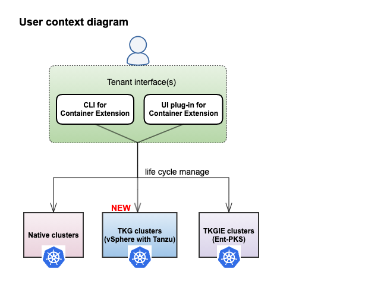

# What's new in CSE 3.0?

For greenfield installations, please get started with [CSE introduction](INTRO.html).

## 1. Overview
* Starting CSE 3.0, CLI for Container Service Extension and Kubernetes Clusters UI Plugin can be used to
manage Cloud Director provisioned [Tanzu Kubernetes Clusters](https://docs.vmware.com/en/VMware-Cloud-Director/10.2/VMware-Cloud-Director-Service-Provider-Admin-Portal-Guide/GUID-E9839D4E-3024-445E-9D08-372113CF6FE0.html)
 alongside Native and TKGI (Ent-PKS) clusters.

* CSE 3.0 has been redesigned to consume latest technology from Cloud Director 10.2, like [Defined entity framework](https://docs.vmware.com/en/VMware-Cloud-Director/10.2/VMware-Cloud-Director-Service-Provider-Admin-Portal-Guide/GUID-0749DEA0-08A2-4F32-BDD7-D16869578F96.html), 
and placement policies. CSE native clusters are now represented as runtime
defined entities to leverage VCD database for persistence. CSE 3.0 also uses
placement policies for [restricting native clusters deployments](TEMPLATE_MANAGEMENT.html#restrict_templates)
to specific organization VDCs. Users will not see any functional difference 
between CSE 3.0 native clusters and previously deployed native clusters in the 
context of Kubernetes. Additionally, users can now leverage VCD’s defined 
entity APIs to query for CSE native clusters

* CSE 3.0 also offers a new command group for TKGI (Ent-PKS).

* Newer versions of native Kubernetes templates are available. 
Refer to [Template announcements](TEMPLATE_ANNOUNCEMENTS.html).

**Terminology:**
* TKG cluster ~ Tanzu Kubernetes  cluster ~ Tanzu Kubernetes Grid cluster ~ vSphere with Tanzu cluster
* TKGI cluster ~ Ent-PKS cluster ~ Tanzu Kubernetes Grid Integrated Edition cluster
* Defined entities ~ Runtime defined entities ~ RDE ~ Defined Entity Framework
* Native entities: Native defined entities representing Native clusters.
* Tkg entities: Tkg defined entities representing Tkg clusters

## 2. Provider workflows

### 2.1 Compatibility matrix and relevant features

| CSE Server | CSE CLI | CSE UI | Cloud Director | Ent-PKS with NSX-T | Features offered                                                                                    |
|------------|---------|--------|----------------|--------------------|-----------------------------------------------------------------------------------------------------|
| 3.0        | 3.0     | 2.0*   | 10.2           | 1.7 with 2.5.1     | Native, Tkg, and Ent-PKS Cluster management; Defined entity representation for both native and tkg. |
| 3.0        | 3.0     | 1.0.3  | 10.1, 10.0     | 1.7 with 2.5.1     | Native and Ent-PKS cluster management                                                               |
| NA         | 3.0     | 2.0*   | 10.2           | NA                 | Tkg cluster management only                                                                         |

2.0* -> Kubernetes Clusters UI Plugin 2.0 ships with VCD 10.2

| VCD version | Max supported API version |
|-------------|---------------------------|
| 10.2        | 35.0                      |
| 10.1        | 34.0                      |
| 10.0        | 33.0                      |

### 2.2 CSE Server
#### 2.2.1 Greenfield installation
When CSE 3.0 is configured with vCD 10.2, CSE installation command
`cse install -c config.yaml` does two additional steps over previous versions. 
Refer to [CSE 3.0 installation](CSE_SERVER_MANAGEMENT.html#cse30-greenfield).

#### 2.2.2 Brownfield upgrade
CSE 3.0 has been architecturally redesigned to leverage the latest features of
Cloud Director like Defined entity framework and placement policies. The new
command `cse upgrade` has been introduced to make the old environment fully
forward compatible with the latest technologies used in CSE 3.0. Any previous
version of CSE can be directly upgraded to CSE 3.0 using `cse upgrade` command;
Refer to [CSE 3.0 upgrade command](CSE_SERVER_MANAGEMENT.html#cse30-upgrade-cmd).

#### 2.2.3 Tenant onboarding
The provider needs to perform below operations to enable Kubernetes cluster
deployments in tenant organizations and tenant virtual data centers.
1. Grant rights to the tenant users. Refer to [CSE 3.0 RBAC](RBAC.html#DEF-RBAC)
for more details.
2. Enable the desired organization virtual datacenter(s) for either Native or
Tkg cluster or Ent-PKS deployments.
    * Tkg clusters → [Publish Kubernetes policy on VDC for Tkg Clusters](https://docs.vmware.com/en/VMware-Cloud-Director/10.2/VMware-Cloud-Director-Service-Provider-Admin-Portal-Guide/GUID-E9839D4E-3024-445E-9D08-372113CF6FE0.html)
    * Native clusters → [Enable VDC for Native clusters](TEMPLATE_MANAGEMENT.html#restrict_templates).
    * Ent-PKS clusters → [Enable VDC for Ent-PKS clusters](ENT_PKS.html#cse-commands)
3. [Publish Kubernetes Clusters UI Plugin](https://docs.vmware.com/en/VMware-Cloud-Director/10.2/VMware-Cloud-Director-Service-Provider-Admin-Portal-Guide/GUID-A1910FF9-B2CF-49DD-B031-D1245E8740AE.html)
to the desired organizations.

### 2.3 Kubernetes Clusters UI Plugin
Starting CSE 3.0 and VCD 10.2, Kubernetes Clusters UI Plugin 2.0 is available
out of the box with VCD 10.2. Provider can publish it to the desired tenants
to offer Kubernetes services. Refer to [publish Kubernetes Clusters UI Plugin](https://docs.vmware.com/en/VMware-Cloud-Director/10.2/VMware-Cloud-Director-Service-Provider-Admin-Portal-Guide/GUID-A1910FF9-B2CF-49DD-B031-D1245E8740AE.html)

For VCD < 10.2 versions that inter-operate with CSE 3.0, Kubernetes Clusters UI Plugin 1.0.3 must be installed separately by a Provider and published to the desired tenants.
Refer to [Register CSE UI Plugin 1.0.3](CSE_UI_PLUGIN.html) for more details.

## 3. Tenant workflows
Tenant users can manage the Kubernetes cluster deployments either through 
CSE CLI or Kubernetes Clusters UI Plugin

### 3.1 CLI for Container Extension
CSE 3.0 introduces below changes in CLI

1. CLI is smart enough to display the most relevant commands and their options 
based on the API version with which the CSE server runs. This intelligence is 
enabled when the user logs into the environment using `vcd login` command. 
For example: `vcd cse cluster apply` is displayed only when CSE server runs at API version 35.0.
2. New command `vcd cse cluster apply <create_cluster.yaml>` has been introduced
 in CSE 3.0. Refer to [cluster apply usage](CLUSTER_MANAGEMENT.html#cse30_cluster_apply) for more details.
3. One can use CLI to deploy Tkg Clusters on VCD 10.2 without the installation 
of CSE server. CLI directly communicates with VCD to manage Tanzu Kubernetes clusters.
4. Node commands are deprecated in CSE 3.0 for VCD 10.2. All of the node 
management (or) resize operations are done through `vcd cse cluster apply` 
command in CSE 3.0 with VCD 10.2. Node commands continue to be operational for 
CSE server with VCD < 10.2.
5. New command is available for NFS deletion: `vcd cse cluster delete-nfs`
6. Separate command group is dedicated for Ent-PKS: `vcd cse pks –help`

### 3.2 Kubernetes Clusters UI Plugin

For VCD 10.2, you must use the [Kubernetes Clusters UI Plugin 2.0](https://docs.vmware.com/en/VMware-Cloud-Director/10.2/VMware-Cloud-Director-Service-Provider-Admin-Portal-Guide/GUID-A1910FF9-B2CF-49DD-B031-D1245E8740AE.html
) that comes with VCD to manage the cluster deployments.

If you are working with VCD < 10.2, you must use the [Kubernetes Clusters UI
Plugin 1.0.3](CSE_UI_PLUGIN.html) to manage the cluster deployments.

## 4. FAQ
Refer to [Troubleshooting](TROUBLESHOOTING.html) and [Known issues](KNOWN_ISSUES.html) pages.
