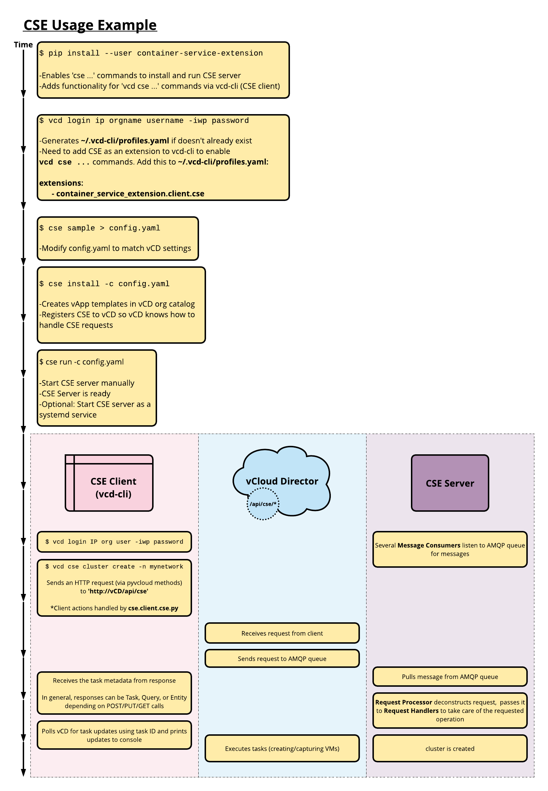

# Kubernetes Cluster Management

<a name="overview"></a>
## Overview

This page shows basic commands that allow tenants to create, manage,
and remove Kubernetes clusters using CSE. The primary tool for these
operations is the `vcd cse` client command.

Here is an overview of the process that a tenant administrator might
go through to install `vcd cse` and create a cluster. It includes
some internals of CSE so that you can understand what is happening
behind the covers.



CSE Kubernetes clusters can include persistent volumes mounted on NFS.
Procedures for creating and managing NFS nodes can be found at
[NFS Node Management](NFS_STATIC_PV.html).

<a name="useful_commands"></a>
## Useful Commands
`vcd cse ...` commands are used by tenant organization administrators and users to:
- list templates
- get CSE server status
- create, list, info, delete clusters/nodes

Here is a summary of commands available to view templates and manage clusters and nodes:

| Command                                                              | API version 35.0 | API version <= 34.0 | Description                                                                |
|----------------------------------------------------------------------|------------------|---------------------|----------------------------------------------------------------------------|
| `vcd cse template list`                                              | Yes              | Yes                 | List templates that a Kubernetes cluster can be deployed from.            |
| `vcd cse cluster apply CLUSTER_CONFIG.YAML`                          | Yes              | No                  | Create or update a Kubernetes cluster.                                     |
| `vcd cse cluster create CLUSTER_NAME`                                | No               | Yes                 | Create a new Kubernetes cluster.                                           |
| `vcd cse cluster create CLUSTER_NAME --enable-nfs`                   | No               | Yes                 | Create a new Kubernetes cluster with NFS Persistent Volume support.        |
| `vcd cse cluster list`                                               | Yes              | Yes                 | List available Kubernetes clusters.                                        |
| `vcd cse cluster info CLUSTER_NAME`                                  | Yes              | Yes                 | Retrieve detailed information of a Kubernetes cluster.                     |
| `vcd cse cluster resize CLUSTER_NAME`                                | No               | Yes                 | Grow a Kubernetes cluster by adding new nodes.                             |
| `vcd cse cluster config CLUSTER_NAME`                                | Yes              | Yes                 | Retrieve the kubectl configuration file of the Kubernetes cluster.         |
| `vcd cse cluster upgrade-plan CLUSTER_NAME`                          | Yes              | Yes                 | Retrieve the allowed path for upgrading Kubernetes software on the custer. |
| `vcd cse cluster upgrade CLUSTER_NAME TEMPLATE_NAME TEMPLATE_REVISION`| Yes              | Yes                 | Upgrade cluster software to specified template's software versions.        |
| `vcd cse cluster delete CLUSTER_NAME`                                | Yes              | Yes                 | Delete a Kubernetes cluster.                                               |
| `vcd cse cluster delete-nfs CLUSTER_NAME NFS_NODE_NAME`              | Yes              | No                  | Delete NFS node of a given Kubernetes cluster                              |
| `vcd cse node create CLUSTER_NAME --nodes n`                         | No               | Yes                 | Add `n` nodes to a Kubernetes cluster.                                     |
| `vcd cse node create CLUSTER_NAME --nodes n --enable-nfs`            | No               | Yes                 | Add an NFS node to a Kubernetes cluster.                                   |
| `vcd cse node list CLUSTER_NAME`                                     | No               | Yes                 | List nodes of a cluster.                                                   |
| `vcd cse node info CLUSTER_NAME NODE_NAME`                           | No               | Yes                 | Retrieve detailed information of a node in a Kubernetes cluster.           |
| `vcd cse node delete CLUSTER_NAME NODE_NAME`                         | No               | Yes                 | Delete nodes from a cluster.                                               |

For CSE versions < 3.0, by default, CSE Client will display the task progress until the
task finishes or fails. The `--no-wait` flag can be used to skip waiting on the
task. CSE client will still show the task information of console, and end user
can choose to monitor the task progress manually.

```sh
> vcd --no-wait cse cluster create CLUSTER_NAME --network intranet --ssh-key ~/.ssh/id_rsa.pub

# displays the status and progress of the task
> vcd task wait 377e802d-f278-44e8-9282-7ab822017cbd

# lists the current running tasks in the organization
> vcd task list running
```
<a name="cse30_cluster_apply"></a>
### CSE 3.0 `Cluster apply` command

1. `vcd cse cluster apply <create_cluster.yaml>` command - Takes a cluster specification file as an input and applies it to a cluster resource. The cluster resource will be created if it does not exist. 
    * Command usage examples:
        ```sh
        vcd cse cluster apply <resize_cluster.yaml> (applies the specification on the resource specified; the cluster resource will be created if it does not exist). 
        vcd cse cluster apply --sample --tkg (generates the sample specification file for tkg clusters).
        vcd cse cluster apply --sample --native (generates the sample specification file for native clusters).
        ```
    * Sample input specification file
        ```sh
        # Short description of various properties used in this sample cluster configuration
        # kind: The kind of the Kubernetes cluster.
        #
        # metadata: This is a required section
        # metadata.cluster_name: Name of the cluster to be created or resized
        # metadata.org_name: The name of the Organization in which cluster needs to be created or managed.
        # metadata.ovdc_name: The name of the Organization Virtual data center in which the cluster need to be created or managed.
        #
        # spec: User specification of the desired state of the cluster.
        # spec.control_plane: An optional sub-section for desired control-plane state of the cluster. The properties "sizing_class" and "storage_profile" can be specified only during the cluster creation phase. These properties will no longer be modifiable in further update operations like "resize" and "upgrade".
        # spec.control_plane.count: Number of control plane node(s). Only single control plane node is supported.
        # spec.control_plane.sizing_class: The compute sizing policy with which control-plane node needs to be provisioned in a given "ovdc". The specified sizing policy is expected to be pre-published to the given ovdc.
        # spec.control_plane.storage_profile: The storage-profile with which control-plane needs to be provisioned in a given "ovdc". The specified storage-profile is expected to be available on the given ovdc.
        #
        # spec.k8_distribution: This is a required sub-section.
        # spec.k8_distribution.template_name: Template name based on guest OS, Kubernetes version, and the Weave software version
        # spec.k8_distribution.template_revision: revision number
        #
        # spec.nfs: Optional sub-section for desired nfs state of the cluster. The properties "sizing_class" and "storage_profile" can be specified only during the cluster creation phase. These properties will no longer be modifiable in further update operations like "resize" and "upgrade".
        # spec.nfs.count: Nfs nodes can only be scaled-up; they cannot be scaled-down. Default value is 0.
        # spec.nfs.sizing_class: The compute sizing policy with which nfs node needs to be provisioned in a given "ovdc". The specified sizing policy is expected to be pre-published to the given ovdc.
        # spec.nfs.storage_profile: The storage-profile with which nfs needs to be provisioned in a given "ovdc". The specified storage-profile is expected to be available on the given ovdc.
        #
        # spec.settings: This is a required sub-section
        # spec.settings.network: This value is mandatory. Name of the Organization's virtual data center network
        # spec.settings.rollback_on_failure: Optional value that is true by default. On any cluster operation failure, if the value is set to true, affected node VMs will be automatically deleted.
        # spec.settings.ssh_key: Optional ssh key that users can use to log into the node VMs without explicitly providing passwords.
        #
        # spec.workers: Optional sub-section for the desired worker state of the cluster. The properties "sizing_class" and "storage_profile" can be specified only during the cluster creation phase. These properties will no longer be modifiable in further update operations like "resize" and "upgrade". Non uniform worker nodes in the clusters is not yet supported.
        # spec.workers.count: number of worker nodes (default value:1) Worker nodes can be scaled up and down.
        # spec.workers.sizing_class: The compute sizing policy with which worker nodes need to be provisioned in a given "ovdc". The specified sizing policy is expected to be pre-published to the given ovdc.
        # spec.workers.storage_profile: The storage-profile with which worker nodes need to be provisioned in a given "ovdc". The specified storage-profile is expected to be available on the given ovdc.
        #
        # status: Current state of the cluster in the server. This is not a required section for any of the operations.
         
        api_version: ''
        kind: native
        metadata:
          cluster_name: cluster_name
          org_name: organization_name
          ovdc_name: org_virtual_datacenter_name
        spec:
          control_plane:
            count: 1
            sizing_class: Large_sizing_policy_name
            storage_profile: Gold_storage_profile_name
          expose: false
          k8_distribution:
            template_name: ubuntu-16.04_k8-1.17_weave-2.6.0
            template_revision: 2
          nfs:
            count: 1
            sizing_class: Large_sizing_policy_name
            storage_profile: Platinum_storage_profile_name
          settings:
            network: ovdc_network_name
            rollback_on_failure: true
            ssh_key: null
          workers:
            count: 2
            sizing_class: Medium_sizing_policy_name
            storage_profile: Silver_storage_profile
        status:
          cni: null
          exposed: False
          docker_version: null
          kubernetes: null
          nodes: null
          os: null
          phase: null
          task_href: null
        ```
      
<a name="k8s_upgrade"></a>
## Upgrading software installed on Kubernetes clusters
Kubernetes is a fast paced piece of software, which gets a new minor release
every three months and numerous patch releases (including security patches) in
between those minor releases. To keep already deployed clusters up to date, in
CSE 2.6.0 we have added support for in place software upgrade for Kubernetes
clusters. The softwares that can be upgraded to a newer version are
* Kuberenetes components e.g. kube-server, kubelet, kubedns etc.
* Weave (CNI)
* Docker engine

The upgrade matrix is built on the CSE native templates (read more about them
[here](TEMPLATE_MANAGEMENT.html)). The template
originally used to deploy a cluster determines the valid target templates for
upgrade. The supported upgrade paths can be discovered using the following command

```sh
vcd cse cluster upgrade-plan 'mycluster'
```

Let's say our cluster was deployed using template T1 which is based off
Kubernetes version `x.y.z`. Our potential target templates for upgrade will
satisfy at least one of the following criteria:
* A later revision of the template T1, which is based off Kubernetes version
  `x.y.`**`w`**, where `w` > `z`.
* A template T2 that has the same base OS, and is based off Kubernetes
  distribution `x.`**`(y+1)`**`.v`, where `v` can be anything.

If you don't see a desired target template for upgrading your cluster, please
feel free to file a GitHub [issue ](https://github.com/vmware/container-service-extension/issues).


The actual upgrade of the cluster is done via the following command.
```sh
vcd cse cluster upgrade 'mycluster'
```

The upgrade process needs little to zero downtime, if the following conditions
are met,
1. Docker is not being upgraded.
2. Weave (CNI) is not being upgraded.
3. Kubernetes version upgrade is restricted to patch version only.

If any of the conditions mentioned above is not met, the cluster will go down
for about a minute or more (depends on the actual upgrade process).

<a name="automation"></a>
## Automation
`vcd cse` commands can be scripted to automate the creation and operation
of Kubernetes clusters and nodes.

Users can interact with CSE via the Python package (container-service-extension)
or the CSE REST API exposed via VCD.

This following Python script creates a Kubernetes cluster on vCloud Director:
```python
#!/usr/bin/env python3
from pyvcloud.vcd.client import BasicLoginCredentials
from pyvcloud.vcd.client import Client
from container_service_extension.client.cluster import Cluster

client = Client('vcd.mysp.com')
client.set_credentials(BasicLoginCredentials('usr1', 'org1', '******'))

cse = Cluster(client)
result= cse.create_cluster('vdc1', 'net1', 'cluster1')
task = client.get_resource(result['task_href'])
task = client.get_task_monitor().wait_for_status(task)
print(task.get('status'))

client.logout()
```

<a name="example"></a>
## Example Use Case

Please note that several of the commands are version specific. Not all the 
commands are applicable to all versions of CSE. Please refer to [CLI commands per CSE version](TROUBLESHOOTING.html#cmds-per-cse)

```sh
# [CSE 3.0] create the cluster
> vcd cse cluster apply create_cluster.yaml

# [CSE 3.0] resize the cluster
> vcd cse cluster apply resize_cluster.yaml

# [CSE 3.0] scale-up nfs nodes in a given cluster
> vcd cse cluster apply scale_up_nfs.yaml

# [CSE 3.0] Delete Nfs node in a given cluster
> vcd cse cluster delete-nfs mycluster nfsd-ghyt

# create cluster mycluster with one control plane and two nodes, connected to provided network
# a public key is provided to be able to ssh into the VMs
> vcd cse cluster create mycluster --network intranet --ssh-key ~/.ssh/id_rsa.pub

# list the worker nodes of a cluster
> vcd cse node list mycluster

# create cluster mycluster with one control plane, three nodes and connected to provided network
> vcd cse cluster create mycluster --network intranet --nodes 3 --ssh-key ~/.ssh/id_rsa.pub

# create a single worker node cluster, connected to the specified network. Nodes can be added later
> vcd cse cluster create mycluster --network intranet --nodes 0 --ssh-key ~/.ssh/id_rsa.pub

# create cluster mycluster with one control plane, three worker nodes, connected to provided network
# and one node of type NFS server
> vcd cse cluster create mycluster --network intranet --nodes 3 --ssh-key ~/.ssh/id_rsa.pub --enable-nfs

# add 2 worker nodes to a cluster with 4GB of ram and 4 CPUs each, from a photon template,
# using the specified storage profile
> vcd cse node create mycluster --nodes 2 --network intranet --ssh-key ~/.ssh/id_rsa.pub --memory 4096 --cpu 4 --template-name sample_photon_template --template-revision 1 --storage-profile sample_storage_profile

# add 1 nfsd node to a cluster with 4GB of ram and 4 CPUs each, from a photon template,
# using the specified storage profile
> vcd cse node create mycluster --nodes 1 --type nfsd --network intranet --ssh-key ~/.ssh/id_rsa.pub --memory 4096 --cpu 4 --template-name sample_photon_template --template-revision 1 --storage-profile sample_storage_profile

# resize the cluster to have 8 worker node. If resize fails, the cluster is returned to it's original size.
# '--network' is only applicable for clusters using native (VCD) Kubernetes provider.
> vcd cse cluster resize mycluster --network mynetwork --nodes 8

# info on a given node. If the node is of type nfsd, it displays info about Exports.
> vcd cse node info mycluster nfsd-dj3s

# delete 2 nodes from a cluster
> vcd cse node delete mycluster node-dj3s node-dj3s --yes

# list available clusters
> vcd cse cluster list

# info on a given cluster
> vcd cse cluster info

# retrieve cluster config
> vcd cse cluster config mycluster > ~/.kube/config

# check cluster configuration
> kubectl get nodes

# deploy a sample application
> kubectl create namespace sock-shop

> kubectl apply -n sock-shop -f "https://github.com/microservices-demo/microservices-demo/blob/master/deploy/kubernetes/complete-demo.yaml?raw=true"

# check that all pods are running and ready
> kubectl get pods --namespace sock-shop

# access the application
> IP=`vcd cse cluster list|grep '\ mycluster'|cut -f 1 -d ' '`
> open "http://${IP}:30001"

# delete cluster when no longer needed
> vcd cse cluster delete mycluster --yes
```

<a name="expose_cluster"></a>
## Creating clusters in Organizations with routed OrgVDC networks

Traditionally, CSE requires a directly connected OrgVDC network for K8s cluster deployment.
This is to make sure that the cluster VMs are reachable from outside the scope of the
OrgVDC network. With NSX-T, directly connected OrgVDC networks are not offered and
routed OrgVDC networks are used to deploy K8s clusters. In order to grant Internet access
to the cluster VMs connected to NSX-T backed routed OrgVDC networks, and maintain
accessibility to the clusters, CSE 3.0.2 offers an option to `expose` the cluster.

Users deploying clusters must have the following rights, if they want to leverage
the `expose` functionality.

* Gateway View
* NAT View Only
* NAT Configure

If even one of these rights are missing, CSE will ignore the request to expose the K8s cluster.

User can `expose` their K8s cluster during the first `vcd cse cluster apply`
command by specifying `expose : True` under `spec` section in the cluster
specification file. It should be noted that any attempt to expose the cluster after it has
been created will be ignored by CSE. Once a cluster has been exposed, the `status`
section of the cluster would show a new field viz. `exposed`, which would be set to `True`.


Users can de-`expose` a cluster, by setting the value of `expose` field to `False`
and applying the updated specification on the cluster via `vcd cse cluster apply`.
The value for the `exposed` field would be `False` for clusters that are not exposed.
An exposed cluster if ever de-exposed can't be re-exposed.
