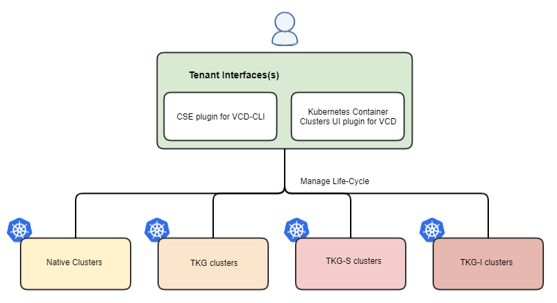

# What's new in CSE 3.1?

For greenfield installations, please get started with [CSE introduction](INTRO.html).

## 1. Overview

* CSE 3.1 need not be started with a particular VCD API version. It is now capable of
  accepting incoming requests at any supported VCD API version. Refer to changes in the [configuration file](#cse31-config).

* A new version of the template recipe cookbook 2.0.0 is introduced. Each template has
  a new descriptor that lets CSE 3.1 determine the templates it can support.
  Refer to changes in the [configuration file](#cse31-config)

* CSE CLI offers new capabilities to upgrade and share clusters. Refer to the [commands](CLUSTER_MANAGEMENT.html#cse31_cluster_apply) here.

* Kubernetes Clusters UI Plugin 3.0 offers a new capability to upgrade clusters.
  It also enables one to view clusters that are deployed across multisite VCD instances.

* Newer versions of native Kubernetes templates are available. Refer to
  [Template announcements](TEMPLATE_ANNOUNCEMENTS.html)

* CSE 3.1 drops the support with VCD 10.0.

* Deprecation of TKGI (Enterprise PKS) - CSE Server and Kubernetes Container Clusters plug-in will soon drop support TKGI (previously known as Enterprise PKS). Consider using CSE-TKG or VCD-Tanzu for management of Kubernetes clusters with VCD.

**Terminology:**
* TKGS cluster ~ Tanzu Kubernetes Grid Service cluster ~ vSphere with Tanzu cluster
* TKGI cluster ~ Ent-PKS cluster ~ Tanzu Kubernetes Grid Integrated Edition cluster
* Defined entities ~ Runtime defined entities ~ RDE ~ Defined Entity Framework
* Native entities: Native defined entities representing Native clusters.
* Tkg entities: Tkg defined entities representing TKGS clusters
* Defined entity API: VCD's generic defined entity api to manage lifecycle of RDEs.

## 2. Provider workflows

### 2.1 Compatibility matrix and relevant features

| CSE Server | CSE CLI | CSE UI | Cloud Director | Ent-PKS with NSX-T | NSX-V  | Features offered                                                                                    |
|------------|---------|--------|----------------|--------------------|--------|-----------------------------------------------------------------------------------------------------|
| 3.1        | 3.1     | 3.0*   | 10.3           | 1.7 with 2.5.1     | 6.4.10 | Native, TKG-S, and Ent-PKS Cluster management; Life cycle management of both native through VCD defined entity API  |
| 3.1        | 3.1     | 2.0*   | 10.2           | 1.7 with 2.5.1     | 6.4.10 | Native, TKG-S, and Ent-PKS Cluster management; Defined entity representation for both native and tkg. |
| 3.1        | 3.1     | 1.0.3  | 10.1           | 1.7 with 2.5.1     | 6.4.8  | Native and Ent-PKS cluster management                                                               |
| NA         | 3.1     | 3.0*   | 10.3           | NA                 | NA     | TKG-S cluster management only                                                                         |
| NA         | 3.1     | 2.0*   | 10.2           | NA                 | NA     | TKG-S cluster management only                                                                         |

3.0*, 2.0* -> Kubernetes Clusters UI Plugins 3.0 and 2.0 ship with VCD 10.3 and VCD 10.2 respectively.

| VCD version | Max supported API version |
|-------------|---------------------------|
| 10.3        | 36.0                      |
| 10.2        | 35.0                      |
| 10.1        | 34.0                      |

### 2.2 CSE Server

#### 2.2.0 Changes in the configuration file
Refer to the [sample config file](CSE_CONFIG.html)

1. Removal of property [api_version](CSE_CONFIG.html#api_version)
2. Addition of property [legacy_mode](CSE_CONFIG.html#legacy_mode)
3. [New template cookbook 2.0](CSE_CONFIG.md#template_cookbook_20) is introduced;
   refer to the  `remote_template_cookbook_url` for the location
4. [mqtt](CSE_CONFIG.html#mqtt) property must be enabled when CSE 3.1 is configured with VCD 10.3.

#### 2.2.1 Greenfield installation

Refer to [CSE 3.1 installation](CSE_SERVER_MANAGEMENT.html#cse31-greenfield).

#### 2.2.2 Brownfield upgrade

CSE 3.1 can only be upgraded from CSE 3.0.z product line. Any CSE release older than CSE 3.0 first needs to be upgraded to CSE 3.0 product line before it can be upgraded to CSE 3.1.

Note: If Tanzu Kubernetes Grid (TKG) distribution is enabled in [CSE 3.0.3](https://github.com/vmware/container-service-extension-templates/blob/tkgm/TKG_INSTRUCTIONS.md), then CSE 3.0.3 will not be upgraded to CSE 3.1.

Refer to [CSE 3.1 upgrade command](CSE_SERVER_MANAGEMENT.html#cse31-upgrade-cmd) for details.

#### 2.2.3 Tenant onboarding
The provider needs to perform below operations to enable Kubernetes cluster
deployments in tenant organizations and tenant virtual data centers.
1. Grant rights to the tenant users. Refer to [CSE 3.1 RBAC](RBAC.html#DEF-RBAC)
for more details.
2. Enable the desired organization virtual datacenter(s) for either Native or
Tkg cluster or Ent-PKS deployments.
    * Tkg clusters → [Publish Kubernetes policy on VDC for Tkg Clusters](https://docs.vmware.com/en/VMware-Cloud-Director/10.3/VMware-Cloud-Director-Service-Provider-Admin-Portal-Guide/GUID-E9839D4E-3024-445E-9D08-372113CF6FE0.html)
    * Native clusters → [Enable VDC for Native clusters](TEMPLATE_MANAGEMENT.html#restrict_templates).
    * Ent-PKS clusters → [Enable VDC for Ent-PKS clusters](ENT_PKS.html#cse-commands)
3. [Publish Kubernetes Clusters UI Plugin](https://docs.vmware.com/en/VMware-Cloud-Director/10.3/VMware-Cloud-Director-Service-Provider-Admin-Portal-Guide/GUID-A1910FF9-B2CF-49DD-B031-D1245E8740AE.html)
to the desired organizations.

### 2.3 Kubernetes Clusters UI Plugin
Kubernetes Clusters UI Plugin 3.0 is available out of the box with VCD 10.3. Provider can publish it to the desired tenants
to offer Kubernetes services. Refer to [publish Kubernetes Clusters UI Plugin](https://docs.vmware.com/en/VMware-Cloud-Director/10.3/VMware-Cloud-Director-Service-Provider-Admin-Portal-Guide/GUID-A1910FF9-B2CF-49DD-B031-D1245E8740AE.html).
For VCD 10.2 that inter-operates with CSE 3.1, Provider must use the Kubernetes Clusters UI Plugin 2.0 that comes with VCD to offer Kubernetes Services.
For VCD < 10.2 versions that inter-operate with CSE 3.1, Kubernetes Clusters UI Plugin 1.0.3 must be installed separately by a Provider and published to the desired tenants.
Refer to [Register CSE UI Plugin 1.0.3](CSE_UI_PLUGIN.html) for more details.

## 3. Tenant workflows
Tenant users can manage the Kubernetes cluster deployments either through
CSE CLI or Kubernetes Clusters UI Plugin

### 3.1 CLI for Container Extension
CSE 3.1 introduces below changes in CLI

1. Cluster upgrades (Native and vSphere with Tanzu) can now be performed using `vcd cse cluster apply <upgrade_cluster.yaml>`.
   Refer to [cluster apply usage](CLUSTER_MANAGEMENT.html#cse31_cluster_apply) for more details.
2. Clusters can be shared to other users using new `vcd cse cluster share` command.
   Refer to [cluster share usage](CLUSTER_MANAGEMENT.html#cse31_cluster_share)

### 3.2 Kubernetes Clusters UI Plugin

For VCD 10.3, you must use the [Kubernetes Clusters UI Plugin 3.0](https://docs.vmware.com/en/VMware-Cloud-Director/10.3/VMware-Cloud-Director-Service-Provider-Admin-Portal-Guide/GUID-A1910FF9-B2CF-49DD-B031-D1245E8740AE.html
) that comes with VCD to manage the cluster deployments.
For VCD 10.2, you must use the [Kubernetes Clusters UI Plugin 2.0](https://docs.vmware.com/en/VMware-Cloud-Director/10.2/VMware-Cloud-Director-Service-Provider-Admin-Portal-Guide/GUID-A1910FF9-B2CF-49DD-B031-D1245E8740AE.html
) that comes with VCD to manage the cluster deployments.

If you are working with VCD < 10.2, you must use the [Kubernetes Clusters UI
Plugin 1.0.3](CSE_UI_PLUGIN.html) to manage the cluster deployments.

## 4. FAQ
Refer to [Troubleshooting](TROUBLESHOOTING.html) and [Known issues](KNOWN_ISSUES.html) pages.
