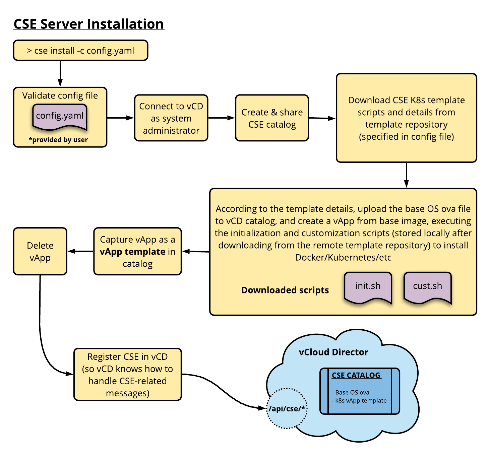

# CSE Server Management

<a name="overview"></a>

## Overview

This page contains procedures to install and manage Container Service
Extension (CSE) on VMware Cloud Director (VCD). Users who perform these procedures
are termed as `Cloud Administrators`, they must have at least the role of
[`CSE Service Role`](CSE_INSTALL_PREREQUISITES.html#service_account) (if the role is not present then the user need to have
`sysadmin` access) and a solid understanding of VCD server management.

Procedures on this page make regular use of vcd-cli commands to
perform administrative operations. If necessary, please refer to the
[vcd-cli documentation](https://vmware.github.io/vcd-cli/) to familiarize
yourself with vcd-cli.


<a name="server_setup"></a>

## Server Setup

### Installing CSE Server

`CSE` Server should be installed by the Cloud Administrator on a new VM or one
of the existing servers that are part of VCD installation. This CSE VM is
the **CSE appliance**.

The CSE appliance requires network access to the VCD cell, vCenter(s),
and AMQP server. It does not require access to the network(s) that powers the
org VDC where the Kubernetes templates will be created nor the tenant network(s)
that powers that org VDC where the clusters will be deployed. Please find more
details on the VCD prerequisites for CSE installation [here](CSE_INSTALL_PREREQUISITES.html).

The CSE software should be installed on the CSE appliance as described [here](INSTALLATION.html).

Next, CSE server setup should be invoked via the `cse install` command.
The example below shows a typical invocation.

```sh
cse install -c config.yaml
```

Please find more details on how to generate sample config file and populate it correctly, [here](CSE_CONFIG.html).

The following diagram illustrates installation steps visually.


<a name="cse31-greenfield"></a>
When CSE 3.1 is connected to Cloud Director 10.3, CSE installation command 
`cse install -c config.yaml` performs below steps.

1. Prepares the environment for Providers to be able to perform organization 
virtual datacenter enablement for native clusters. Refer [how to enable ovdc(s) for native deployments](TEMPLATE_MANAGEMENT.html#cse30-restrict_templates) 
for more details on how CSE 3.0 leverages placement policies to restrict k8 
deployments on organizational virtual datacenters (ovdcs).
2. Registers defined entity schema 2.0.0 and relevant behaviors for native clusters. As a side effect, 
`cse:native cluster entitlement` right bundle gets created in the Cloud Director 
and all native cluster operations are guarded by these rights.
Invoke below API to get a detailed view of native defined entity schema - `https://<vcd-ip>/cloudapi/2.0.0/entityTypes/urn:vcloud:type:cse:nativeCluster:2.0.0`
3. Registers CSE as an API extension to VCD.

The `cse install` command supports the following options:

| Option                    | Short | Argument(s)                        | Description                                                                                                      | Default Value | Notes                |
|---------------------------|-------|------------------------------------|------------------------------------------------------------------------------------------------------------------|---------------|----------------------|
| \--config                 | -c    | path to config file                | Filepath of CSE config file to use for installation                                                              | config.yaml   |                      |
| \--pks-config-file        | -p    | path to Enterprise PKS config file | Filepath of Enterprise PKS config file to use for installation                                                   | -             |                      |
| \--retain-temp-vapp       | -d    | n/a                                | Retain the temporary vApp after the template has been captured --ssh-key option is required if this flag is used | False         | Removed in CSE 3.1.2 |
| \--skip-config-decryption | -s    | n/a                                | Skips decrypting the configuration file and pks configuration file, and assumes them to be plain text            | -             |                      |
| \--skip-template-creation | -t    | n/a                                | Skips creating CSE k8s template during installation                                                              | False         | Removed in CSE 3.1.2 |
| \--ssh-key                | -k    | path to public ssh key file        | ssh-key file to use for VM access (root password ssh access is disabled for security reasons)                    | -             | Removed in CSE 3.1.2 |

For CSE 3.1.0 and CSE 3.1.1, during template creation, to monitor the vApp customization process,
we can ssh into the temporary vApp. In the temporary vApp, the output of the customization script
is captured in `/tmp/FILENAME.out` as well as `/tmp/FILENAME.err`:

```sh
# print out file contents as it's being written to
tail -f /tmp/FILENAME.out
tail -f /tmp/FILENAME.err
```

<a name="cse31-upgrade-cmd"></a>
### CSE 3.1 Upgrade Command

The command `cse upgrade` must be run to ensure the environment is forward 
compatible with CSE 3.1. Few or all of the below steps will be performed based 
on the VCD version CSE 3.1 is configured with.

* Delete old compute policies in the environment: untag old templates with 
existing compute policies, unpublish existing compute policies from the 
organization virtual data center(s), delete the old compute policies. Note 
that this clean-up is done only on CSE-created compute policies.
* Prepare the environment to be able to perform organization virtual datacenter 
enablement for native clusters. 
* Auto-install templates of the latest revision unless specified otherwise. (Not  applicable for CSE 3.1.2 and CSE 3.1.3)
* Identify existing organization virtual datacenter(s) with existing clusters 
and publish appropriate placement policies on the same.
* Make pre-existing clusters forward compatible.
* Register native RDE `urn:vcloud:type:cse:nativeCluster:X.0.0`
* Register relevant RDE behaviors.
* Convert legacy clusters to RDE based clusters.
* Update RDE 1.0 clusters to RDE 2.0 clusters.

CSE 3.1.2 can be upgraded from 3.1.0, 3.1.1 or 3.0.X.
CSE 3.1.1 can be upgraded from 3.1.0 or 3.0.X.
CSE 3.1.0 can only be upgraded from 3.0.X.
Below are the few valid upgrade paths and the resultant changes in the environment.

An example on reading below upgrade paths - `CSE 3.0.X, VCD 10.2 (api_version=34.0) -> CSE 3.1, VCD 10.2 (legacy_mode=true)`:
Environment with CSE 3.0.X, configured with VCD 10.2, running at the specified api_version=34.0 (config.yaml) 
can be upgraded to environment CSE 3.1, configured with VCD 10.2, running with `legacy_mode` set to true.

1. CSE 3.0.X, VCD 10.1 (api_version=34.0) -> CSE 3.1, VCD 10.1 (legacy_mode=true)
   - Native clusters will remain regular vApps with Kubernetes specific metadata.
   - Existing Kubernetes templates will not work as-is. Either templates should be 
     recreated, or the [workaround](KNOWN_ISSUES.html#templates-upgrade) 
     should be applied.
2. CSE 3.0.X, VCD 10.2 (api_version=34.0) -> CSE 3.1, VCD 10.2 (legacy_mode=false)
   - Native clusters will have a new representation in the form of 
     RDE `urn:vcloud:type:cse:nativeCluster:1.0.0` entities.
3. CSE 3.0.X, VCD 10.2 (api_version=34.0) -> CSE 3.1, VCD 10.3 (legacy_mode=false)
   - Native clusters will have a new representation  in the form of 
     RDE `urn:vcloud:type:cse:nativeCluster:2.0.0` entities.
4. CSE 3.0.X, VCD 10.2 (api_version=35.0) -> CSE 3.1, VCD 10.3 (legacy_mode=false)
   - Native clusters will be updated froms `urn:vcloud:type:cse:nativeCluster:1.0.0`
     to `urn:vcloud:type:cse:nativeCluster:2.0.0` entities.
    
Note the below recommendation when the target combination is CSE 3.1 (legacy_mode=false):
- CSE 3.1 will do its best effort to make the existing templates forward compatible. 
  It is recommended to recreate the templates from the new template cookbook 2.0 to avoid any errors.

Note for CSE 3.1.3: Because CSE 3.1.3 uses RDE 2.1, the above holds true, except that
`urn:vcloud:type:cse:nativeCluster:2.1.0` instead of `urn:vcloud:type:cse:nativeCluster:2.0.0` will be used,
and RDE 1.0 clusters will be upgraded to use RDE 2.1.

### Validate CSE Installation

To validate that CSE server has been installed correctly, use the command
`cse check`.

```sh
cse check config.yaml --check-install
```

The validity and integrity of just the CSE config file can be checked using the
following command.
```sh
cse check config.yaml
cse check config.yaml --pks-config-file pks.yaml
```

The `cse check` command supports the following options:

| Option                    | Short | Argument(s)                        | Description                                                                                           | Default |
|---------------------------|-------|------------------------------------|-------------------------------------------------------------------------------------------------------|---------|
| \--check-install          | -i    | n/a                                | Check CSE installation on VCD                                                                         | False   |
| \--pks-config-file        | -p    | path to Enterprise PKS config file | Enterprise PKS config file to validate along with CSE config file                                     | -       |
| \--skip-config-decryption | -s    | n/a                                | Skips decrypting the configuration file and PKS configuration file, and assumes them to be plain text | -       |

Validate that CSE has been registered with VCD as an extension, via vcd-cli:
```sh
# login as cloud administrator
vcd login vcd.serviceprovider.com system <administrator user name> --password <password> -w -i

# list AMQP based api extensions
vcd system extension list

# get details of CSE extension
vcd system extension info cse
```

**Note**: For MQTT based api extensions, a REST client should be used instead, since `vcd-cli` is not capable of
lsiting or interacting with MQTT based api extensions.

```sh
GET /cloudapi/extensions/api
GET /cloudapi/extensions/api/urn:vcloud:extension-api:VMWare:cse:1.0.0
```

<a name="extension-timeout"></a>
### Setting the API Extension Timeout

The API extension timeout is the duration (in seconds) that VCD waits for
a response from the CSE server extension. The default value is 10 seconds,
which may be too short for some environments. To alter the timeout value,
follow the steps below.

Configure the API extension timeout on the VCD cell:

```sh
cd /opt/vmware/vcloud-director/bin
./cell-management-tool manage-config -n extensibility.timeout -l
./cell-management-tool manage-config -n extensibility.timeout -v 20
```


### Sharing CSE catalog with non admin tenant users

CSE installation creates a catalog to store all the Kubernetes templates that are later
used to deploy Kubernetes clusters. This catalog is by default shared with all
users across all organizations who has the right `Catalog: View Published Catalogs`.
Users with `Organization Administrator` role, already has this right baked into their role.
However if users who are not organization administrator want to access this catalog
(cluster creation requires access to this catalog), they need to be assigned a role
that has the above mentioned right. The following set of commands can be used to
achieve the desired outcome.

```sh
# login as system/cloud administrator
vcd login vcd.serviceprovider.com system administrator --password passw0rd -w -i

# switch over to the tenant organization
vcd org use myorg

# add the right to the role of the user in question
vcd role add-right <role name> 'Catalog: View Published Catalogs'

# built-in roles can't be edited and needs to be cloned first
vcd role clone <built role e.g. "vApp Author"> 'New Role'
vcd role add-right 'New Role' 'Catalog: View Published Catalogs'

# Assign this new role to the user in question via VCD UI or
# create a new user in the organization with the new role
vcd user create <new user name> <password> 'New Role' --enabled
```

---

<a name="server_operation"></a>

## Server Operation

### Running CSE Server Manually

To start the server manually, run the command shown below.

```sh
# Run server in foreground.
cse run --config config.yaml

# Run server in background
nohup cse run --config config.yaml > nohup.out 2>&1 &
```

Refer to [Log bundles](TROUBLESHOOTING.html#log-bundles) to see server-side logs.

### Running CSE Server as a Service

A sample `systemd` unit is provided by CSE. Here are instructions for
installation.

* Copy the file `cse.service` from CSE installation location or download it from [here](https://raw.githubusercontent.com/vmware/container-service-extension/master/cse.service)
and move it to `/etc/systemd/system/cse.service`.
* Copy the file `cse.sh` from CSE installation location or download it from [here](https://raw.githubusercontent.com/vmware/container-service-extension/master/cse.sh)
to `/home/{user}`.

Once installed you can start the CSE service daemon using `systemctl start cse`.
To enable, disable, and stop the CSE service remotely, use CSE client.

```sh
# hook CSE unit into relevant places to automatically do things
# depending on what's specified in the unit file
$ vcd cse system enable

# start CSE service now
$ systemctl start cse

# stop processing new requests, and finish processing existing requests
# disables CSE service
$ vcd cse system disable
property    value
----------  ----------------------
message     CSE has been disabled.

# wait until all active threads have finished, then exits CSE service
$ vcd cse system stop -y
property    value
----------  ------------------------------
message     CSE graceful shutdown started.
```

If the CSE Server is disabled, users will get the following message
when executing any CSE command:

```sh
$ vcd cse cluster list
Usage: vcd cse cluster list

Error: CSE service is disabled. Contact the System Administrator.
```

To keep the service running after logout on Photon OS, check
`/etc/systemd/logind.conf` and set `KillUserProcesses` to `no`

```sh
[Login]
KillUserProcesses=no
```

### Monitoring CSE

Cloud Administrators can monitor CSE service status via CSE client:

```sh
$ vcd cse system info
property                           value
---------------------------------  ------------------------------------------------------
all_consumer_threads               4
all_threads                        7
config_file                        config.yaml
cse_server_api_version             36.0
cse_server_running_in_legacy_mode  False
cse_server_supported_api_versions  35.0
                                   36.0
description                        Container Service Extension for VMware vCloud Director
product                            CSE
python                             3.7.3
requests_in_progress               1
status                             Running
version                            3.1.1
```
---

<a name="server_upgrade"></a>

## Server Upgrade and Removal

### Upgrading CSE Server Software

1. Gracefully stop CSE Server.
2. Reinstall `container-service-extension` from PyPI:
   * `pip3 install --user --upgrade container-service-extension`
3. Check the [release notes](RELEASE_NOTES.html) for version compatibility.
4. Use `cse sample` command to generate a new sample config file and fill in
   the relevant values from the previous config file.
5. If the previously generated templates are no longer supported by the new version,
   delete the old templates (from VCD UI / vcd-cli) and generate new ones via
   * `cse template install -c myconfig.yaml`
   Check [here](TEMPLATE_ANNOUNCEMENTS.html) for available templates.
6. Run `cse upgrade` command to make the environment forward compatible. Refer [CSE 3.0 upgrade command](CSE_SERVER_MANAGEMENT.html#cse30-upgrade-cmd)
7. If CSE is being run as a service, start the new version of the service with
   * `systemctl start cse`.

### Uninstalling CSE Server

* Gracefully stop CSE Server
* As Cloud Administrator, unregister CSE from VCD:
   * AMQP : `vcd system extension delete cse`
   * MQTT : Disable and remove the `cse` extension via a REST client

```
GET /cloudapi/extensions/api/urn:vcloud:extension-api:VMWare:cse:1.0.0

# Copy the payload, and change enabled to `false`

PUT /cloudapi/extensions/api/urn:vcloud:extension-api:VMWare:cse:1.0.0

DELETE /cloudapi/extensions/api/urn:vcloud:extension-api:VMWare:cse:1.0.0
```

* (Optional) Delete Kubernetes templates and the CSE catalog from VCD.

---

<a name="commands_sys_admin"></a>

## Useful Commands

`cse ...` commands are used by cloud administrators to:

* Install CSE Server
* Upgrade CSE Server to make older environments forward compatible with CSE version > 3.0
* Create/Update templates
* Run CSE Server manually

`vcd cse ...` commands are used by cloud administrators to:

* Monitor status of CSE Server and clusters
* Operate CSE as a service
* Enable a given organization vdc for either Native or Enterprise PKS deployments.

The following show useful sample commands.

```sh
# Use '-h' option to see help page and options for any cse command.
cse -h
cse install --config config.yaml -h
cse upgrade --config config.yaml -h
cse check config.yaml -h
cse run --config config.yaml -h

# Show all available vcd cse commands.
vcd cse -h

# Login to VCD to use vcd-cli commands.
vcd login <VCD HOSTNAME> system <USERNAME> -iwp <PASSWORD>

# Let SAMPLE_ORG_NAME be active org for this session.
vcd org use SAMPLE_ORG_NAME

# Let SAMPLE_VDC_NAME be active vdc for this session.
vcd vdc use SAMPLE_VDC_NAME

# Enable organization vdc for Native
vcd cse ovdc enable SAMPLE_VDC_NAME

# Enable organization vdc for TKGi (Enterprise PKS)
vcd cse pks ovdc enable SAMPLE_VDC_NAME

```
