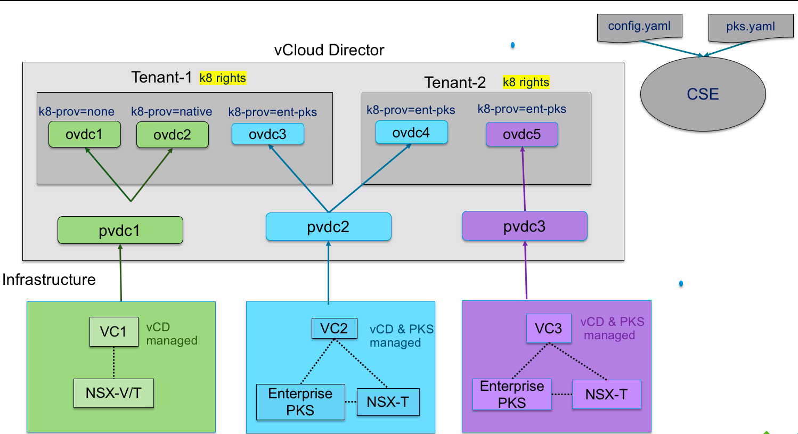
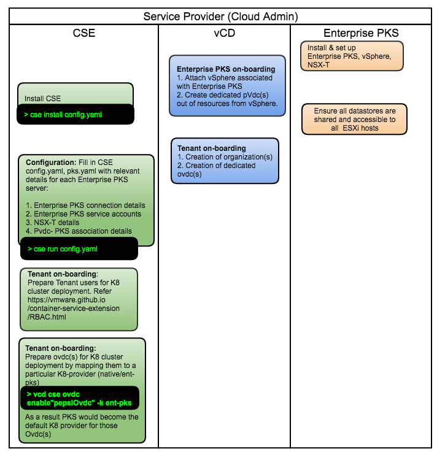
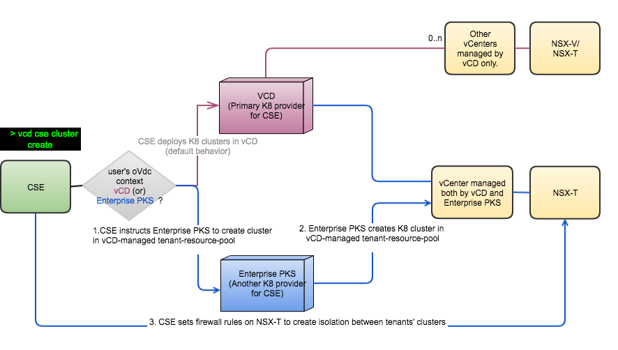
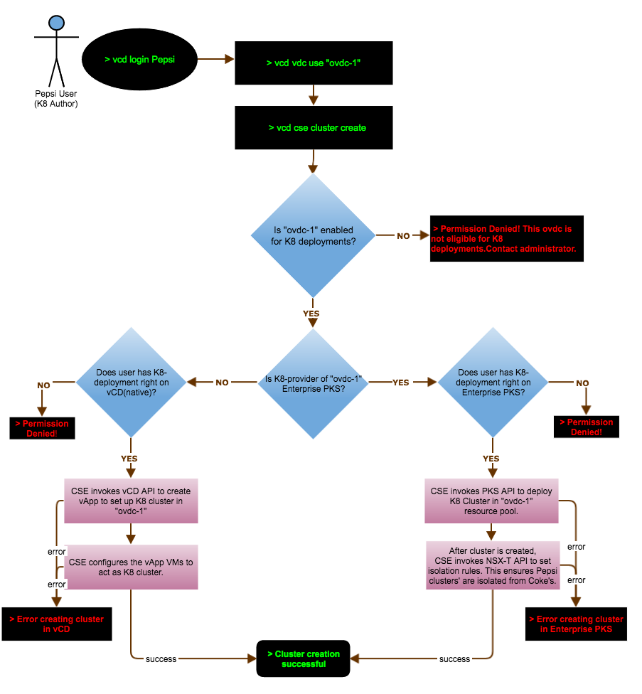

## Deprecation Notice

CSE Server and Kubernetes Container Clusters plug-in will soon drop support for TKGI (previously known as Enterprise PKS). Consider using VMware Tanzu Kubernetes Grid or VMware Tanzu Kubernetes Grid Service for management of Kubernetes clusters with VCD.

# Enterprise PKS enablement
<a name="overview"></a>
## Overview
CSE 2.0 enables orchestration of K8 cluster deployments on VMware Enterprise PKS.
At the same time, it maintains the CSE 1.x feature set of Native K8 cluster deployments
 directly on VMware vCloud Director. As a result, the capabilities of CSE 2.0 allow
 tenants to leverage both K8 Providers, Native and Enterprise PKS, for seamless K8
 cluster deployments while ensuring clusters' isolation between tenants.
 It also offers great flexibility to administrators to onboard tenants on K8 Provider(s)
  of their choice, be it Native and/or Enterprise PKS.


This page talks in detail about CSE 2.0 architecture with Enterprise PKS,
the infrastructure set-up, configuration steps, as well as, key command line
interfaces for K8 deployments.

<a name="architecture"></a>
## Architecture
CSE 2.0 architecture comprises of Enterprise PKS Infrastructure stack, vCloud
Director Infrastructure stack, and CSE 2.0 modules. The Enterprise PKS
Infrastructure stack is necessary only if there is an intention to leverage it
for K8 cluster deployments. The diagram below illustrates a physical view of
the complete infrastructure, as well as, its logical mapping in to vCloud
Director hierarchy, for ease of understanding.

Legend:
* Green - Depicts vSphere infrastructure managed by vCloud Director, just as
CSE 1.x, without any of Enterprise PKS.
* Blue - Depicts the Enterprise PKS infrastructure stack managed and available
for use in vCloud Director for K8 cluster deployments. It also illustrates
multi-tenancy for K8 cluster deployments on single Enterprise PKS infrastructure.
* Purple - Depicts a single tenant dedicated Enterprise PKS infrastructure
stack managed and available for use in vCloud Director for K8 cluster
deployments. It also illustrates the use-case of a tenant leveraging multiple
instances of Enterprise PKS infrastructure stack, say, to segregate K8s cluster
workloads.
* K8-prov - This label depicts the K8 Provider that is enabled on a given
tenant's Organization VDC in vCloud Director.



<a name="infra-view"></a>
## Infrastructure set-up and configuration

### Before you begin

1. Ensure fresh installation of Enterprise PKS infrastructure stack.
Also, ensure there are no prior K8 cluster deployments on this stack.
2. Ensure CSE, vCloud Director infrastructure stack, and Enterprise PKS
infrastructure stack are all in the same management network, without proxy in between.

### Enterprise PKS on-boarding

Below timeline diagram depicts infrastructure set-up and tenant
 on-boarding. Cloud-provider has to do below steps before on-boarding tenants.
 1. Set up one or more Enterprise PKS-vSphere-NSX-T instances.
 2. Ensure [OpenID Connect](https://openid.net/connect/) feature is disabled on
  each Enterprise-PKS instance. Refer [FAQ](#faq) for more details.
 3. Create [Enterprise PKS service accounts](#faq) per each Enterprise PKS instance.
 4. On-board Enterprise PKS instance(s) in VCD
    * Attach Enterprise PKS' corresponding vSphere in VCD through VCD UI.
    * Create provider-vdc(s) in VCD from underlying resources of newly attached
      Enterprise PKS' vSphere(s). Ensure these pvdc(s) are dedicated for Enterprise
      PKS K8 deployments only.
 5. Install, configure and start CSE
    * Follow instructions to install CSE 2.0 beta [here](RELEASE_NOTES.html)
    * Use `cse sample` command to generate `config.yaml` and `pks.yaml` skeleton config files.
    * Configure `config.yaml` with VCD details.
    * Configure `pks.yaml` with Enterprise PKS details. This file is necessary
      only if there is an intention to leverage Enterprise PKS for K8
      deployments. Refer [here](CSE_CONFIG.html#ent_pks_config)
      for more details on how to fill in `pks.yaml`.
    * Run `cse install` command. Specify the Enterprise PKS configuration file
      along with regular CSE configuration file via the flag --pks-config-file
      and --config respectively. The install process will prepare NSX-T(s) of
      Enterprise PKS instances for tenant isolation. Ensure this command is run
      again for on-boarding of new Enterprise PKS instances at later point of time.
    * Start the CSE service. Specify the Enterprise PKS configuration file
      along with regular CSE configuration file via the flag --pks-config-file
      and --config respectively.

Enabling Enterprise PKS as a K8s provider changes the default behavior of CSE
as described below. Presence of option `--pks-config <pks-config-file> ` while
executing `cse run` gives an indication to CSE that Enterprise PKS is enabled
(in addition to Native VCD) as a K8s provider in the system.

* CSE begins to mandate that all `ovdc` has to be enabled for either Native or
Enterprise PKS as a backing K8s provider. Cloud Administrators can do so via
`vcd cse ovdc enable` command. This step is mandatory for ovdc(s) with
pre-existing native K8s clusters as well i.e., if CSE is upgraded from 1.2.x
to 2.0.0 and CSE is started with `--pks-config-file` option, then it becomes
mandatory to enable those ovdc(s) with pre-existing native K8s clusters.
* In other words, if CSE runs with `--pks-config-file PKS_CONFIG_FILE_PATH` and
if an ovdc is not enabled for either of the supported K8s providers, users will
not be able to do any further K8s deployments on that ovdc.

If CSE runs without `--pks-config-file` option, there will not be any change in
CSE's default behavior i.e., all ovdc-s are open for native K8s cluster deployments.

 <a name="tenant-onboarding"></a>
### Tenant on-boarding
1. Create ovdc(s) in tenant organization from newly created provider-vdc(s) above via VCD UI.
Do not choose Pay-as-you-go model for ovdc(s). Refer [FAQ](#faq) for more details.
2. Use these [CSE commands](#cse-commands) to grant K8 deployment rights to chosen tenants and tenant-users. Refer
[RBAC feature](RBAC.html) for more details
3. Use [CSE command](#cse-commands) to enable organization vdc(s) with a chosen K8-provider (native (or) ent-pks).

Below diagram illustrates a time sequence view of setting up the infrastructure for CSE 2.0,
 followed by the on boarding of tenants. The expected steps are executed by Cloud providers
 or administrators.



<a name="communication-view"></a>
## CSE, VCD, Enterprise PKS Component Illustration
Below diagram outlines the communication flow between components for the tenant's
work-flow to create a new K8 cluster.

Legend:
* The path depicted in pink signifies the work-flow of K8 cluster deployments on Native K8 Provider Solution in CSE 2.0.
* The path depicted in blue signifies the work-flow of K8 cluster deployments on Enterprise K8 Provider Solution in CSE 2.0.

Refer [tenant-work-flow](#tenant-work-flow) to understand the below decision
box in grey color in detail.


<a name="tenant-work-flow"></a>
## Tenant work-flow of create-cluster operation

To understand the creation of new K8 cluster work-flow in detail, review below flow chart in its entirety.
In this illustration, user from  tenant "Pepsi" attempts to create a new K8 cluster
 in organization VDC "ovdc-1", and based on the administrator's enablement for "ovdc-1",
 the course of action can alter.


<a name="cse-commands"></a>
## CSE commands
### Administrator commands to on board a tenant

**Granting rights to Tenants and Users:**

Below steps of granting rights are required only if [RBAC feature](RBAC.html) is turned on.

```sh
* vcd right add "{cse}:CSE NATIVE DEPLOY RIGHT" -o tenant1
* vcd right add "{cse}:CSE NATIVE DEPLOY RIGHT" -o tenant2
* vcd right add "{cse}:PKS DEPLOY RIGHT" -o tenant1
```
```sh
* vcd role add-right "Native K8 Author" "{cse}:CSE NATIVE DEPLOY RIGHT"
* vcd role add-right "PKS K8 Author" "{cse}:PKS DEPLOY RIGHT"
* vcd role add-right "Omni K8 Author" "{cse}:CSE NATIVE DEPLOY RIGHT"
* vcd role add-right "Omni K8 Author" "{cse}:PKS DEPLOY RIGHT"
```
```sh
* vcd user create 'native-user' 'password' 'Native K8 Author'
* vcd user create 'pks-user' 'password' 'PKS K8 Author'
* vcd user create 'power-user' 'password' 'Omni K8 Author'
```

**Enabling ovdc(s) for Ent-PKS deployments:**
Starting CSE 3.0, separate command group has been dedicated to Ent-PKS
```sh
* vcd cse pks ovdc list
* vcd cse pks ovdc enable ovdc2 -o tenant1 -k ent-pks --pks-plan "gold" --pks-cluster-domain "tenant1.com"
```

### Cluster management commands
Starting CSE 3.0, separate command group has been dedicated to Ent-PKS
```sh
* vcd cse pks cluster list
* vcd cse pks cluster create
* vcd cse pks cluster info
* vcd cse pks cluster resize
* vcd cse pks cluster delete
```

<a name="faq"></a>
## FAQ

* How to create an Enterprise PKS service account?
    * Refer [UAA Client](https://docs.pivotal.io/runtimes/pks/1-3/manage-users.html#uaa-client)
    to grant PKS access to a client.
    * Define your own `client_id` and `client_secret`. The scope should be
    `uaa.none` and the `authorized_grant_types` should be `client_credentials`
    * Example to create client using UAA CLI: `uaac client add test --name test
    --scope uaa.none
    --authorized_grant_types client_credentials
    --authorities clients.read,clients.write,clients.secret,scim.read,scim.write,pks.clusters.manage`
    * Log in to PKS: `pks login -a https://${PKS_UAA_URL}:9021  -k --client-name test --client-secret xx`
    * Input credentials in pks.yaml
* Why OpenID connect feature needs to remain disabled in Enterprise PKS?
    * OpenID Connect based authentication of VMware Enterprise PKS is a global
    configuration for all tenants. Its enablement misaligns with multi-tenant
    model of Container Services Extension.
* What allocation models are supported for organizational vdc(s) powered by Enterprise PKS?
    * Allocation model and reservation models only. Pay-as-you-go is unsupported.
     Elasticity with other models is also not supported.
* Are Enterprise PKS based clusters visible in VCD UI?
    * Kubernetes Clusters UI Plugin versions 2.0 and 1.0.3, both can be used
    to manage Enterprise PKS Clusters. Refer [compatibility matrix](CSE30.html#cse30-compatibility-matrix)
* Do Enterprise PKS based clusters adhere to their parent organization-vdc compute settings?
    * Yes. Both native and Enterprise PkS clusters' combined usage is accounted towards
    reaching compute-limits of a given organization-vdc resource-pool.
* Are Enterprise PKS clusters isolated at network layer?
    * Yes. Tenant-1 clusters cannot reach Tenant-2 clusters via Node IP addresses.
* Do Enterprise PKS based clusters adhere to its parent organization-vdc storage limits?
    * This functionality is not available yet. As of today, organization-vdc storage limits apply
    only for native K8 clusters.
* Can native K8 clusters be deployed in organization-vdc(s) dedicated for Ent-PKS?
    * This functionality is not available yet.
* Can tenant get a dedicated storage for their Enterprise PKS based clusters?
    * This functionality is not available yet.
* Why is response-time of commands slower sometimes?
    * The response times for commands can be slow due to variety of reasons.
    For example - RBAC feature is known to impose some slowness in the system.
    Enterprise PKS based K8 cluster deployments have some performance implications.
    The performance optimizations will be coming in near future
* If there are Extension time out errors while executing commands, how can they be remedied?
    * Increase the VCD extension timeout to a higher value. Refer to
      [Setting the API Extension Timeout](CSE_SERVER_MANAGEMENT.html#extension-timeout)

<a name="ent-pks"></a>
## Enterprise PKS Limitations

* When attaching an NSX-T-backed vCenter (such as Enterprise PKS vCenter) to a
MicrosoftSQL-backed VCD, the vCenter can fail to connect. Refer to this
[work around](https://docs.vmware.com/en/vCloud-Director/9.7/rn/vmware-vcloud-director-for-service-providers-97-release-notes.html)
* Once `vcd cse pks cluster resize` is run on Enterprise PKS based clusters,
organization administrator's attempts to view and perform CRUD operations on those
clusters will begin to fail with errors.
* Once `vcd cse pks cluster resize` is run on Enterprise PKS based clusters, commands
`vcd cse cluster info` and `vcd cse cluster list` on those resized clusters will begin to display
incomplete results.
* Once a given OrgVDC is enabled for Enterprise PKS,
renaming that OrgVDC in VCD will cause further K8 cluster deployment
failures in that OrgVDC.

<a name="compatibility-matrix"></a>
## Compatibility matrix

|CSE        | Supported VCD Versions |Enterprise PKS| NSX-T    |
|-----------|------------------------|--------------|----------|
|2.0.0 Beta | 9.5, 9.7               | 1.4          | 2.3      |
|2.0.0      | 9.5, 9.7               | 1.4          | 2.3, 2.4 |
|2.5.0      | 9.5, 9.7, 10.0         | 1.4          | 2.3, 2.4 |
|2.6.0 Beta | 9.5, 9.7, 10.0, 10.1   | 1.4          | 2.3, 2.4 |
|2.6.0      | 9.5, 9.7, 10.0, 10.1   | 1.4          | 2.3, 2.4 |
|2.6.1      | 9.5, 9.7, 10.0, 10.1   | 1.7          | 2.5.1    |
|3.0        | 10.0, 10.1, 10.2       | 1.7          | 2.5.1    |


