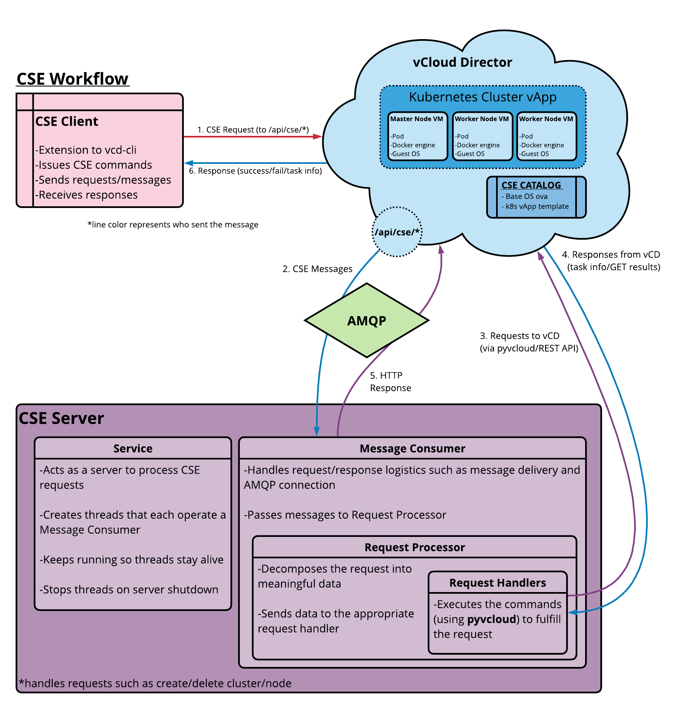
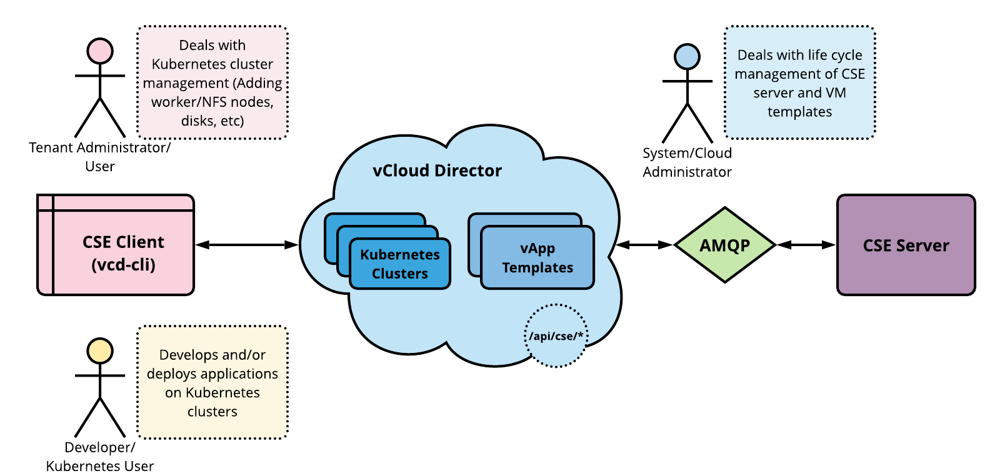
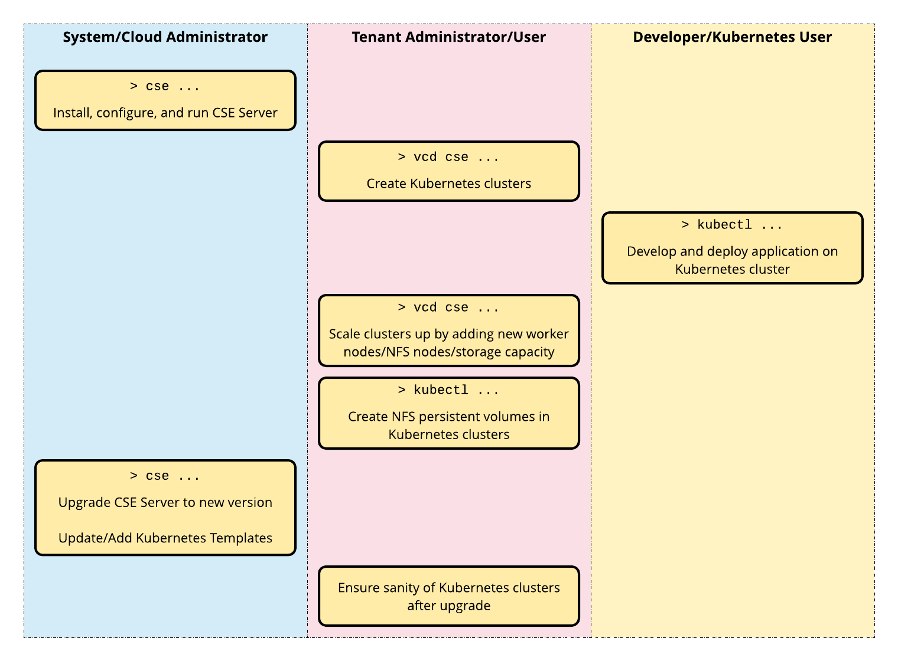

# Introduction

## Overview

Container Service Extension (CSE) is a VMware vCloud Director (VCD)
extension that helps tenants create and work with Kubernetes clusters.

CSE brings _Kubernetes as a Service_ to VCD, by creating customized
VM templates (Kubernetes templates) and enabling tenant users to deploy fully functional
Kubernetes clusters as self-contained vApps.

## How CSE Works

CSE has a server component that installs as a VCD extension. It exposes REST
API endpoint points via VCD. CSE also has a client component that plugs in
``vcd-cli``, communicates with the CSE server via the exposed API endpoints, and
facilitates VCD users to create Kubernetes clusters in VCD. The following
diagram illustrates the interactions between the components.

## CSE User Types

**Cloud administrators** handle setting up VCD, CSE config file, CSE Server,
and Kubernetes templates. Till CSE 3.0.0, the only VCD role that Cloud
administrators were expected to posses was `System Administrator`. However,
with CSE 3.0.1 and onwards, CSE provides a way to create a CSE specific service
role viz. [`CSE Service Role`](CSE_INSTALL_PREREQUISITES.html#service_account),
and cloud administrators are expected to posses this role and be experienced
in VCD administration.

Note: If the role `CSE Service Role` is not available (viz. in VCD 10.1 and
below), then cloud administrators can still be assigned the
`System Administrator` VCD role.

Once CSE Server is running and Kubernetes templates are available, **tenant
organization administrators and users** can use CSE client (``vcd-cli``)
to handle Kubernetes cluster management. This includes deploying
clusters, adding worker nodes, configuring NFS storage, and the
like.

Tenant users who manage Kubernetes clusters are expected to understand
VCD org administration principles. They should have accounts with privileges
required to create vApps and manage them. Finally, such users should understand
Kubernetes cluster management including setting up user access and
defining persistent volumes.

**Developers and other Kubernetes users** interact with CSE Kubernetes
clusters using ``kubectl`` For these users, Kubernetes clusters
work like any other Kubernetes cluster implementation. No special
knowledge of vCloud Director or CSE administration is required.
Such users do not even need a vCloud Director account.

