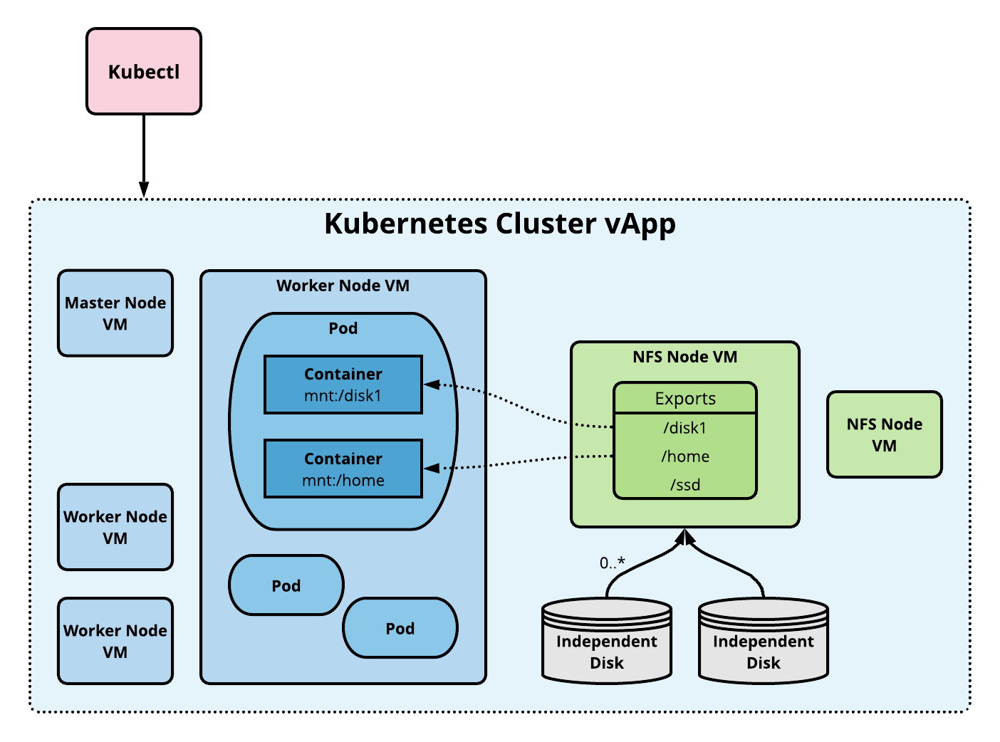

# NFS Node Management
<a name="overview"></a>
## Overview

CSE can automatically add NFS nodes to the Kubernetes configuration
when creating a new cluster. Cluster administrators can use the
NFS node(s) to implement static persistent volumes, which in turn
enable deployment of stateful applications.

This page describes NFS node management and provides a tutorial
example of setting up a persistent volume resource on NFS. The
presentation assumes a basic understanding of [Kubernetes
storage](https://kubernetes.io/docs/concepts/storage/) as well as
[NFS administration](https://help.ubuntu.com/community/SettingUpNFSHowTo).
See the linked articles for more information if needed.

---
<a name="volumes"></a>
## Persistent Volume Types

[Static persistent volumes](https://kubernetes.io/docs/concepts/storage/persistent-volumes/#static)
are pre-provisioned by the cluster administrator. They carry the
details of the real storage which is available for use by cluster
users. They exist in the Kubernetes API and are available for
consumption. Users can allocate a static persistent volume by
creating a persistent volume claim that requires the same or less
storage. CSE supports static volumes hosted on NFS.

[Dynamic persistent volumes](https://kubernetes.io/docs/concepts/storage/persistent-volumes/#dynamic)
are not pre-provisioned by the cluster administrator. When none of
the static persistent volumes match a user’s persistent volume claim,
the cluster may try to dynamically provision a volume for the PVC.
CSE does not currently support dynamic persistent volumes.

<a name="architecture"></a>
## NFS Volume Architecture

An NFS volume allows an existing NFS (Network File System) share
to be mounted into one or more pods. When the pod(s) are removed, the
contents of the NFS volume are preserved and the volume is merely
unmounted. This means that an NFS volume can be pre-populated with
data, and that data can be "handed off" between pods. NFS can be
mounted by multiple writers simultaneously.

To use NFS volumes we need to have our own NFS server running with
the shares exported. CSE provides commands to add pre-configured
NFS server(s) to any given cluster. The following diagram
shows the implementation architecture.



---

<a name="tutorial"></a>
## Storage Tutorial

The following sections illustrate how to manage NFS persistent
volumes starting with setting up a cluster with an NFS node, granting
a persistent storage claim to an application, checking health, and
cleaning up.

### Creating a Cluster with an Attached NFS node

NFS administration starts with cluster creation, where we can
provision an NFS node. Let's create an Ubuntu based cluster using
one of the below commands:
* For CSE 3.0 - vCD 10.2, use [vcd cse cluster apply](CLUSTER_MANAGEMENT.html#cse30_cluster_apply) command
* For CSE 3.0 - vCD < 10.2, use `vcd cse cluster create` command shown below. 
  The `--enable-nfs` option signals that CSE should include an NFS node. The `--ssh-key` 
  option ensures nodes are provisioned with the user's SSH key. The 
  SSH key is necessary to login to the NFS host and set up shares.
    1. ```shell
       # Login.
       vcd login cse.acme.scom devops imanadmin  --password='T0pS3cr3t'
       # Create cluster with 2 worker nodes and NFS server node.
       vcd cse cluster create mycluster --nodes 2 \
       --network mynetwork -t ubuntu-16.04_k8-1.13_weave-2.3.0 -r 1 --enable-nfs \
       --ssh-key ~/.ssh/id_rsa.pub
       ```
       This operation will take several minutes while the CSE extension builds the
       Kubernetes vApp.
    2. You can also add a node to an existing cluster using a command like the 
    following.
        ```shell
        # Add an NFS server (node of type NFS).
        vcd cse node create mycluster --nodes 1 --network mynetwork \
        -t ubuntu-16.04_k8-1.13_weave-2.3.0 -r 1 --enable-nfs
        ```


### Setting up NFS Shares

The next step is to create NFS shares that can be allocated via persistent
volume resources. First, we need to add an independent disk to the NFS
node to create a file system that we can export.

```shell
# List the VMs in the vApp to find the NFS node. Look for a VM name that
# starts with 'nfsd-', e.g., 'nfsd-ljsn'. Note the VM name and IP address.
vcd vapp info mycluster
# Create a 100Gb independent disk and attach to the NFS VM.
vcd disk create nfs-shares-1 100g --description 'Kubernetes NFS shares'
vcd vapp attach mycluster nfsd-ljsn nfs-shares-1
```

Next, ssh into the NFS host itself.
```shell
ssh root@10.150.200.22
... (root prompt appears) ...
```

Partition and format the new disk. On Ubuntu the disk will
show up as /dev/sdb. The procedure below is an example; feel free
to use other methods depending on your taste in Linux administration.

```
root@nfsd-ljsn:~# parted /dev/sdb
(parted) mklabel gpt
Warning: The existing disk label on /dev/sdb will be destroyed and all data on
this disk will be lost. Do you want to continue?
Yes/No? yes
(parted) unit GB
(parted) mkpart primary 0 100
(parted) print
Model: VMware Virtual disk (scsi)
Disk /dev/sdb: 100GB
Sector size (logical/physical): 512B/512B
Partition Table: gpt
Disk Flags:

Number  Start   End    Size   File system  Name     Flags
 1      0.00GB  100GB  100GB               primary

(parted) quit
root@nfsd-ljsn:~# mkfs -t ext4 /dev/sdb1
Creating filesystem with 24413696 4k blocks and 6111232 inodes
Filesystem UUID: 8622c0f5-4044-4ebf-95a5-0372256b34f0
Superblock backups stored on blocks:
	32768, 98304, 163840, 229376, 294912, 819200, 884736, 1605632, 2654208,
	4096000, 7962624, 11239424, 20480000, 23887872

Allocating group tables: done
Writing inode tables: done
Creating journal (32768 blocks): done
Writing superblocks and filesystem accounting information: done
```

Create a mount point, add the new partition to your list of file systems,
and mount it.

```shell
mkdir /export
echo '/dev/sdb1  /export   ext4  defaults   0 0' >> /etc/fstab
mount -a
```

At this point you should have a working file system under /export.
The last step is to create directories and share them via NFS.

```
cd /export
mkdir vol1 vol2 vol3 vol4 vol5
vi /etc/exports
...Add following at end of file...
/export/vol1 *(rw,sync,no_root_squash,no_subtree_check)
/export/vol2 *(rw,sync,no_root_squash,no_subtree_check)
/export/vol3 *(rw,sync,no_root_squash,no_subtree_check)
/export/vol4 *(rw,sync,no_root_squash,no_subtree_check)
/export/vol5 *(rw,sync,no_root_squash,no_subtree_check)
...Save and quit
exportfs -r
```

Our work to prepare the file system shares is complete. You can
logout from the NFS node.

### Using Kubernetes Persistent Volumes

To use the shares we must create persistent volume resources. To start
with let's grab the kubeconfig so we can access the new Kubernetes cluster.

```shell
vcd cse cluster config mycluster > mycluster.cfg
export KUBECONFIG=$PWD/mycluster.cfg
```

Create a persistent volume resource for the share on /export/vol1.
The path name should match the export name or you will get failures
when Kubernetes tries to mount the NFS share to a pod.

```shell
cat <<EOF | kubectl apply -f -
apiVersion: v1
kind: PersistentVolume
metadata:
  name: nfs-vol1
spec:
  capacity:
    storage: 10Gi
  accessModes:
    - ReadWriteMany
  nfs:
    # Same IP as the NFS host we ssh'ed to earlier.
    server: 10.150.200.22
    path: "/export/vol1"
EOF
```

Next create a persistent volume claim that matches the persistent
volume size.

```shell
cat <<EOF | kubectl apply -f -
apiVersion: v1
kind: PersistentVolumeClaim
metadata:
  name: nfs-pvc
spec:
  accessModes:
    - ReadWriteMany
  storageClassName: ""
  resources:
    requests:
      storage: 10Gi
EOF
```

We now launch an application that uses the persistent volume claim.
This example runs busybox in a couple of pods that write to the
shared storage.

```shell
cat <<EOF | kubectl apply -f -
apiVersion: v1
kind: ReplicationController
metadata:
  name: nfs-busybox
spec:
  replicas: 2
  selector:
    name: nfs-busybox
  template:
    metadata:
      labels:
        name: nfs-busybox
    spec:
      containers:
      - image: busybox
        command:
          - sh
          - -c
          - 'while true; do date > /mnt/index.html; hostname >> /mnt/index.html; sleep $(($RANDOM % 5 + 5)); done'
        imagePullPolicy: IfNotPresent
        name: busybox
        volumeMounts:
          # name must match the volume name below
          - name: nfs
            mountPath: "/mnt"
      volumes:
        - name: nfs
          persistentVolumeClaim:
            claimName: nfs-pvc
EOF
```

### Checking Health

We can check the state of the deployed application and its storage. First
let's ensure all resources are in good health.
```shell
kubectl get pv
kubectl get pvc
kubectl get rc
kubectl get pods
```

We can now look at the state of the storage using the handy
`kubectl exec` command to run a command on one of the pods. (Substitute
the correct pod name from your `kubectl get pods` output.)
```
$ kubectl exec -it nfs-busybox-gcnht cat /mnt/index.html
Fri Dec 28 00:16:08 UTC 2018
nfs-busybox-gcnht
```

If you run the previous command multiple times you will see the date and host change as pods write to the index.html file.

### Cleaning Up

To complete the tutorial, clean up Kubernetes resources as follows.
```shell
kubectl delete rc/nfs-busybox
kubectl delete pvc/nfs-pvc
kubectl delete pv/nfs-vol1
```

<a name="faq"></a>
## FAQ
- What is the difference between a persistent volume (PV) and persistent
volume claim (PVC)?
    - A persistent volume is ready-to-use storage space created by
    the cluster admin. CSE currently only supports static persistent
    volumes. A persistent volume claim is the storage requirement
    specified by the user. Kubernetes dynamically binds/unbinds the PVC
    to PV at runtime. Learn more
    [here](https://kubernetes.io/docs/concepts/storage/persistent-volumes/#static)

- How are NFS exports mounted to containers?
    - Once a persistent volume backed by NFS is created by the cluster
    admin, Kubernetes mounts the specified NFS export to pod(s) and
    hence the containers they run.

- What happens to storage when a Kubernetes application terminates?
    - Kubernetes returns the persistent volume and its claim to the
    pool. The data from the application remains on the volume. It
    can be cleaned up manually by logging into the NFS node VM and
    deleting files.
    
<a name="nfs"></a>
### NFS Limitations

Currently, NFS servers in a Kubernetes cluster are not only accessible
by nodes of that cluster but also by any VM (outside of the cluster)
residing in the same OrgVDC. Ideal solution is to have vApp network
created for each Kubernetes cluster, which is in our road-map to
implement. Until then, please choose one of below workarounds to
avert this problem if the need arises.

* Give access to only control plane & worker nodes of the cluster by adding individual
  IPs of the nodes into /etc/exports file on NFS server.
    * Create and run a script periodically which retrieves IPs of nodes in the
      cluster and then add them to NFS server access list (/etc/exports).
    ```sh
       /home 203.0.113.256(rw,sync,no_root_squash,no_subtree_check) 203.0.113.257(rw,sync,no_root_squash,no_subtree_check)
    ```
* Administrator can manually add a vApp network for each Kubernetes cluster in VCD.
* Create a ssh tunnel from each worker node (using ssh local port forwarding) and then
  use `127.0.0.1:<port>` in the Kubernetes declarative specs as IP of the NFS server.
    * In NFS server, for any given shared directory, add below line to `/etc/exports` file.
      * `/home localhost(insecure,rw,sync,no_subtree_check)`
      * `systemctl restart nfs-kernel-server.service`
      * Copy ssh public key of each worker node into `~/.ssh/authorized_keys` in NFS server
    * Client: Generate key using `ssh-keygen` and copy the contents of `~/.ssh/id_rsa.pub`
    * NFS server: Paste the contents (public key) from client into `~/.ssh/authorized_keys`
    * In each control plane/worker node,
      * `apt-get install portmap`
      * `ssh -fNv -L 3049:127.0.0.1:2049 user@NFSServer`
    * Read more about this approach at
      * http://www.debianadmin.com/howto-use-ssh-local-and-remote-port-forwarding.html
      * https://gist.github.com/proudlygeek/5721498
