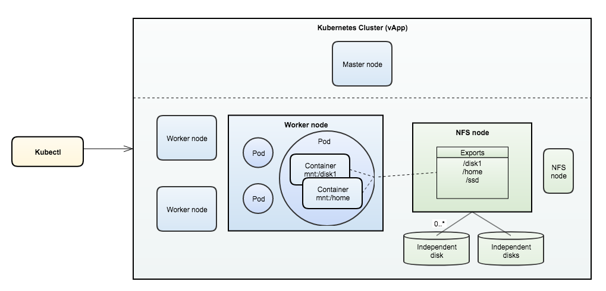
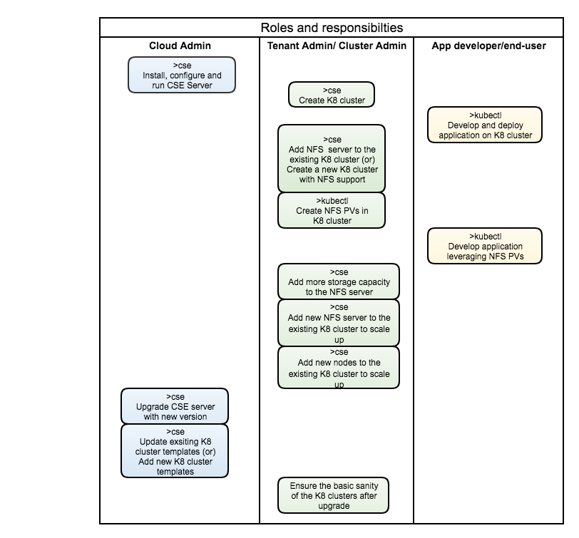

## Introduction

This feature of CSE enables users to deploy stateful applications by leveraging static persistent volumes backed by NFS server.

### Difference between static and dynamic persistent volumes

[Static PVs](https://kubernetes.io/docs/concepts/storage/persistent-volumes/#static) are pre-provisioned by cluster administrator. They carry the details of the real storage which is available for use by cluster users. They exist in the Kubernetes API and are available for consumption.

[Dynamic PVs](https://kubernetes.io/docs/concepts/storage/persistent-volumes/#dynamic) - When none of the static PVs the administrator created matches a user’s PersistentVolumeClaim, the cluster may try to dynamically provision a volume specially for the PVC.

### Static NFS volumes

An nfs volume allows an existing NFS (Network File System) share to be mounted into your pod. When a Pod is removed, the contents of an nfs volume are preserved and the volume is merely unmounted. This means that an NFS volume can be pre-populated with data, and that data can be “handed off” between pods. NFS can be mounted by multiple writers simultaneously. However, we need to have our own NFS server running with the share exported. CSE provides commands to add pre-configured NFS server(s) to any given cluster and more.

## Architecture



## Who does what (roles and responsibilities)?



# Sample CSE and/or NFS commands

### By Cloud Admin

```shell
    CSE setup & configuration
        cse install -c config.yaml
    Start CSE server
        cse run -c config.yaml
```

### By Tenant Admin

```shell
    Create K8 Cluster with 2 worker nodes and 1 nfs server
        vcd cse cluster create mycluster -N 2 -n mynetwork -t ubuntu-16.04 --enable-nfs
    Add  1 nfs server (node of type NFS) to the existing K8 cluster
        vcd cse node create mycluster -N 1 -n mynetwork -t ubuntu-16.04 --type nfsd
    Get IP of the NFS server(s) & shares exposed (in a given cluster)
        vcd cse cluster info mycluster
    Create NFS persistent volume(s)
        kubectl create -f nfs_pv.yaml
        kubectl get pv
```

### By App Developer

```shell
    Tell Kubectl about the K8 cluster whereabouts
        vcd cse cluster config mycluster > ~/.kube/config
    Create NFS persistent volume claim
        kubectl create -f nfs_pvc.yaml
        kubectl get pvc
    Launch 2 pods of busybox application instances writing to the NFS volume
        kubectl create -f nfs_busybox.yaml
        kubectl get rc
        kubectl get pods
```
### Sample declarative K8 yaml specs to create and use NFS volumes
#### Create NFS persistent volume
```shell
apiVersion: v1
kind: PersistentVolume
metadata:
  name: nfs
spec:
  capacity:
    storage: 1Gi
  accessModes:
    - ReadWriteMany
  nfs:
    # FIXME: use the right IP of NFS server
    server: 10.150.211.68
    path: "/home"
```
#### Create NFS persistent volume claim
```shell
apiVersion: v1
kind: PersistentVolumeClaim
metadata:
  name: nfs-pvc
spec:
  accessModes:
    - ReadWriteMany
  storageClassName: ""
  resources:
    requests:
      storage: 1Gi
```
#### Create application using NFS volumes
```shell
apiVersion: v1
kind: ReplicationController
metadata:
  name: nfs-busybox
spec:
  replicas: 2
  selector:
    name: nfs-busybox
  template:
    metadata:
      labels:
        name: nfs-busybox
    spec:
      containers:
      - image: busybox
        command:
          - sh
          - -c
          - 'while true; do date > /mnt/index.html; hostname >> /mnt/index.html; sleep $(($RANDOM % 5 + 5)); done'
        imagePullPolicy: IfNotPresent
        name: busybox
        volumeMounts:
          # name must match the volume name below
          - name: nfs
            mountPath: "/mnt"
      volumes:
        - name: nfs
          persistentVolumeClaim:
            claimName: nfs-pvc
```
## Known Issues

### NFS server protection
Currently, NFS servers in Kubernetes cluster can not only be accessed by nodes of that cluster but also by any VM (outside of the cluster) residing in the same orgVdc. Ideal solution is to have vApp network created for each Kubernetes cluster, which is in our road-map to implement. Until then, please choose one of below workarounds to avert this problem if the need arises.
- Give access to only master & worker nodes of the cluster by adding individual IPs of the nodes into /etc/exports file on NFS server.
    - Create and run a script periodically which retrieves IPs of nodes in the cluster and then add them to NFS server access list (/etc/exports).
    - eg: /home 203.0.113.256(rw,sync,no_root_squash,no_subtree_check) 203.0.113.257(rw,sync,no_root_squash,no_subtree_check)
- Admin can manually add a vApp network for each kubernetes cluster in vCD.
- Create a ssh tunnel from each worker node (using ssh local port forwarding) and then use 127.0.0.1:<port> in the  Kubernetes declarative specs as IP of the NFS server.
    - In NFS server, for any given shared directory, add below line to /etc/exports file.
        - /home localhost(insecure,rw,sync,no_subtree_check)
        - systemctl restart nfs-kernel-server.service
    - Copy ssh public key of each worker node into ~/.ssh/authorized_keys in NFS server
        - Client: Generate key using ssh-keygen and copy the contents of ~/.ssh/id_rsa.pub
        - NFS server: Paste the contents (public key) from client into ~/.ssh/authorized_keys
    - In each master/worker node,
        - apt-get install portmap
        - ssh -fNv -L 3049:127.0.0.1:2049 user@NFSServer
    - Read more about this approach here
        - http://www.debianadmin.com/howto-use-ssh-local-and-remote-port-forwarding.html
        - https://gist.github.com/proudlygeek/5721498

## FAQ

- What is CSE server?
    - CSE server is an extension to vCD which enables users to create and manage K8 clusters.
- Does vCD-CLI (CSE client) directly talk to CSE server?
    - vCD-CLI communicates only with vCD. Behind the scenes, vCD relays the user (CSE relevant) commands to CSE server.
- What is the difference between persistent volume (PV) and persistent volume claim (PVC)?
    - Static PV is a ready-to-use storage space created by K8 cluster admin. PVC is the storage requirement specified by the user. Kubernetes dynamically binds/unbinds PVC to PV at runtime. Learn more [here](https://kubernetes.io/docs/concepts/storage/persistent-volumes/#static)
- How does NFS exports are mounted to containers?
    - Once a PV backed by NFS export is created by K8 cluster admin, Kubernetes does the job of mounting specified NFS exports to Pods and Containers.
- When to use vCD-CLI vs Kubectl?
    - vCD-CLI talks to vCD. It provides commands to create and manage K8 clusters including adding worker nodes, nfs nodes etc.
    - Kubectl talks to Kubernetes cluster. It provides commands to develop, deploy applications and much more. Learn more [here](https://kubernetes.io/docs/reference/kubectl/overview/)