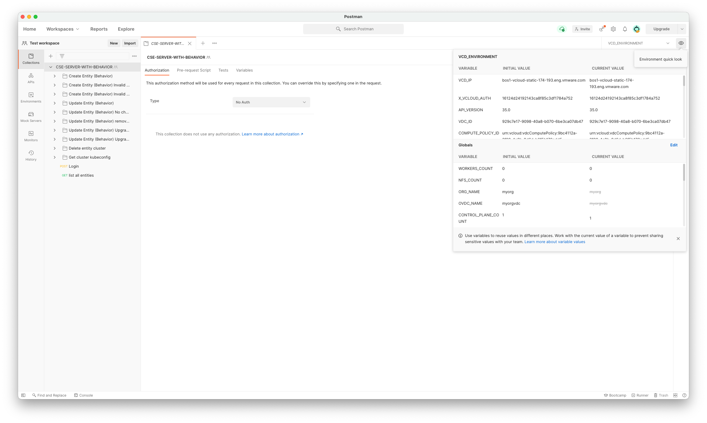

# Executing postman tests
1. **Import `postman_tests` folder to postman**: This can be done by File > Import... > Folder and selecting the postman_tests directory
2. **Setting Postman environment to `VCD_ENVIRONMENT`**:
3. **Edit environment and global variables**: Can be set by selecting the eye icon
4. **Running postman test**: Selecting each folder under Collections > CSE-SERVER-WITH-BEHAVIOR should give you an option to run the test: As soon as the tests are started, a "Runner" will be opened which will execute the tests.

5. Tests can be viewed and edited by selecting each of the request in each folder and navigating to the "Tests" tab. Postman makes use of javascript chai test framework. Important thing to keep in mind is that the tests for each of the requests are executed in order, followed by tests in the folder and followed by tests in the collection.
6. As of now, only test execution is automated. You can see a request named "Login", which automatically sets the environment variable `X_VCLOUD_AUTH`.

# Resources:
- https://learning.postman.com/docs/writing-scripts/test-scripts/